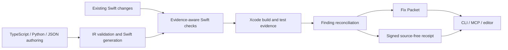
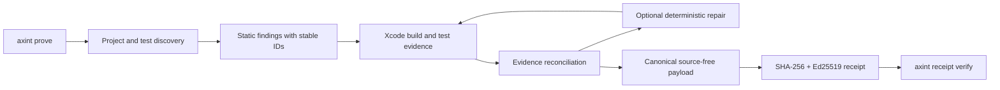

# Axint Architecture

Axint is the proof and repair layer for Apple coding agents. Its architecture
combines an evidence runtime for existing Apple projects with optional authoring
pipelines that generate inspectable Swift. Both paths converge on the same
agent-facing contract: verdict, evidence, findings, next actions, and artifact
paths.

## System shape



The proof runtime is primary. Generation is one way to create a candidate
change; it does not replace Xcode evidence.

## Proof runtime

`axint prove` discovers an Apple project, selects the available Xcode container
and scheme, runs evidence-aware Swift validation, executes a real build and any
available tests, reconciles the findings, and emits a signed source-free
receipt.



Compiler-shaped findings can be confirmed by matching Xcode failures or
suppressed by a successful selected build. Passing tests provide behavior
context, but they do not automatically disprove accessibility, interaction,
privacy, design, or runtime advisories. Gate decisions follow active blocking
findings rather than raw diagnostic severity.

The local private signing key is stored outside the project under the Axint home
directory with owner-only permissions. Receipts contain the public key and its
fingerprint. Teams can provide a managed key through
`AXINT_PROOF_SIGNING_KEY` and name it with `AXINT_PROOF_SIGNER_NAME`.
Verification without `--trusted-fingerprint` proves payload integrity against
the embedded key; it does not establish an externally trusted signer identity.

## Repair artifacts

The [Fix Packet](docs/FIX_PACKET.md) is the local repair contract used by:

- `axint compile`
- `axint watch`
- `axint validate-swift`
- `axint.fix-packet` over MCP
- `axint xcode packet`
- project-aware repair and proof workflows

It preserves stable finding identity, evidence class, likely files, concrete
next actions, and rerun guidance without forcing full logs into agent context.
When coverage is incomplete, the packet lowers confidence instead of treating a
heuristic as compiler truth.

## TypeScript authoring pipeline

The TypeScript compiler parses supported `define*()` calls into a language-
agnostic intermediate representation, validates that IR, generates Swift and
companion metadata, then validates the generated Swift.

```text
TypeScript source
  -> surface parser
  -> IR
  -> IR validator
  -> Swift / plist / entitlement generator
  -> Swift validator
  -> Fix Packet and proof workflow
```

The implemented dispatch covers intents, entities, views, widgets, apps, Live
Activities, App Enums, UnionValue schemas, App Shortcuts, and extension
scaffolds. Each surface owns its parser, validator, and generator while sharing
diagnostic and repair contracts.

`compileFromIR()` accepts an intent IR object or JSON payload and skips the
TypeScript parse step. That is the stable bridge used by JSON workflows and
other language frontends.

## Python authoring pipeline

The Python SDK is a native implementation, not a subprocess wrapper around the
TypeScript generator. `python/axint/` parses Python with the Python AST, produces
compatible IR, validates it, and generates Swift directly through
`generator.py`.

```text
Python source
  -> Python AST parser
  -> compatible IR
  -> Python validator
  -> native Python Swift generator
```

The Python package therefore has no Node.js dependency for its normal parse,
validate, and compile commands. Its IR can optionally be piped into the
TypeScript CLI for an additional cross-surface validation path:

```bash
axint-py parse intent.py --json | axint compile - --from-ir --stdout
```

The two generators intentionally mirror shared contracts but are separate
implementations. Parity tests and compatible IR make divergence visible; the
documentation does not imply that Python shells out for normal generation.

The focused Python MCP server uses native Python generation. One optional Swift
validation helper can call the installed Node package when available, so that
helper is not equivalent to the fully local Python compile path.

## Experimental `.axint` authoring surface

The `.axint` package under `src/core/axint-dsl/` implements tokenization,
recovery-aware parsing, canonical formatting, and lowering for intents,
entities, enums, and safe public-page manifests. The APIs and `axint format`
command are available without a feature flag.

The surface remains experimental because direct `.axint` input is not yet wired
through the main `axint compile` command, and views, widgets, and apps are not
implemented in the language. The language specification documents this
boundary separately from the production proof runtime and the real brownfield
benchmark.

## MCP and CLI boundary

The CLI is the local process boundary for proof, generation, validation, repair,
receipts, telemetry controls, and Xcode orchestration. The MCP server wraps the
same application services for standards-compatible hosts and returns compact
structured results.

Long-running build and test jobs persist status and log paths under `.axint/run`
so a caller can reconnect, inspect, or cancel without keeping the original
request alive. Full logs remain on disk; MCP responses carry summaries and
artifact references.

## Distribution boundary

The public repository ships the open-source compiler, TypeScript and Python
SDKs, CLI, proof runtime, MCP servers, templates, tests, Swift Package Manager
plugins, and editor integrations. Hosted services consume those public
contracts but do not redefine their implementation status.

## Directory map

```text
src/core/                 TypeScript parsers, IR, validators, generators
src/core/axint-dsl/       Experimental .axint lexer, parser, printer, lowering
src/proof/                Proof orchestration and signed receipts
src/run/                  Resumable project jobs and Xcode evidence
src/repair/               Fix Packets and project repair plans
src/feedback/             Source-free finding review and feedback
src/mcp/                  MCP server, manifest, and transports
src/cli/                  Command-line entry points
python/axint/             Native Python parser, IR, validator, generator, MCP
spm-plugin/               Xcode build and validation plugins
benchmarks/brownfield/    Reproducible precision and abstention gate
tests/                    TypeScript integration and unit coverage
python/tests/             Python integration and unit coverage
```

## Extension principles

1. New checks state their evidence boundary and abstain when it is unknown.
2. New authoring surfaces separate parsing, validation, and generation.
3. Generated output remains ordinary, inspectable Swift without runtime lock-in.
4. Agent-facing output stays compact while complete artifacts remain on disk.
5. Public proof claims require a reproducible test, benchmark, or Apple-tooling artifact.
