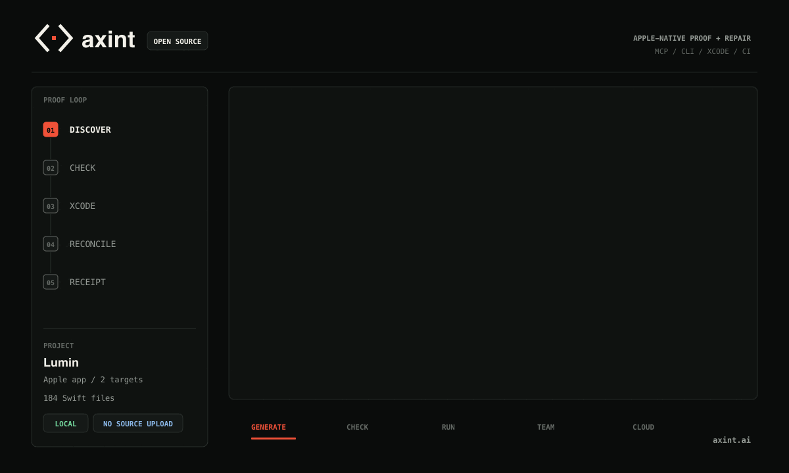

<p align="center">
  <picture>
    <source media="(prefers-color-scheme: dark)" srcset="docs/assets/mark-dark.svg" />
    
  </picture>
  &nbsp;
  <picture>
    <source media="(prefers-color-scheme: dark)" srcset="docs/assets/wordmark-dark.svg" />
    
  </picture>
</p>

<h1 align="center">Agents can write Swift. Axint makes them prove it.</h1>

<p align="center">
  <strong>The proof and repair layer for Apple coding agents.</strong>
</p>

<p align="center">
  Axint checks the Swift your agent wrote, runs the real Xcode build and tests,<br />
  reconciles findings with Apple tooling, and returns signed proof with the exact repairs to make next.<br />
  <strong>No project rewrite. No source upload.</strong>
</p>

<p align="center">
  <a href="https://www.npmjs.com/package/@axint/compiler"></a>
  <a href="https://www.npmjs.com/package/@axint/compiler"></a>
  <a href="https://pypi.org/project/axint/"></a>
  <a href="https://github.com/agenticempire/axint/actions/workflows/ci.yml"></a>
  <a href="LICENSE"></a>
</p>

<p align="center">
  <a href="#prove-an-existing-project"><strong>Prove a project</strong></a> ·
  <a href="https://cloud.axint.ai">Try in browser</a> ·
  <a href="#connect-your-agent">Connect an agent</a> ·
  <a href="https://docs.axint.ai">Docs</a> ·
  <a href="https://github.com/agenticempire/axint-examples">Examples</a> ·
  <a href="#contribute">Contribute</a>
</p>

<p align="center">
  
</p>

<p align="center"><sub>Local by default. Open source. Ordinary Swift.</sub></p>

## A plausible patch is not proof.

Apple software is a graph of contracts. SwiftUI state, App Intents, Siri and
Shortcuts metadata, widgets, entitlements, privacy declarations, concurrency,
build settings, tests, and runtime behavior all have to agree. Code that looks
right can still fail to compile, miss an interaction, or violate a platform
contract.

Axint puts static analysis and Apple tooling into one repair loop. Static checks
identify leads; Xcode build and test output can confirm, contextualize, or
suppress them. The result stays compact enough for the next agent turn while
full logs and artifacts remain on disk.

| Evidence class | What it means |
| --- | --- |
| **Confirmed** | Deterministic analysis or matching compiler, build, or test evidence supports the finding. |
| **Probable** | Strong static evidence identifies a likely problem, but decisive Apple-tooling evidence is incomplete. |
| **Advisory** | A heuristic identifies a quality, accessibility, privacy, interaction, design, or runtime concern for review. |
| **Suppressed** | Stronger evidence or a project-local review contradicts the finding; it remains in the receipt without blocking the result. |

## Prove an existing project

```bash
npx -y -p @axint/compiler axint prove --dir /path/to/MyApp
```

Axint discovers the Xcode project and scheme, checks existing Swift, runs the
available build and tests, reconciles the findings, and writes proof under
`.axint/proof`.

The default local run requires no account or configuration. It does not change
Swift, upload source, install project instructions, install memory or MCP
configuration, apply fixes, or rewrite the project.

When a failure needs another turn, Axint returns a
[**Fix Packet**](docs/FIX_PACKET.md): a compact repair artifact with the finding,
likely files, exact next action, and rerun command. It also writes a
**source-free receipt**: a signed proof file containing evidence, results,
hashes, and repair information without project source.

```bash
axint prove --dir /path/to/MyApp --fix
axint receipt verify /path/to/MyApp/.axint/proof/latest.proof.json
```

`--fix` opts into supported deterministic rewrites and reruns the proof loop.
Receipt verification checks payload integrity and the embedded Ed25519 signer.
A locally signed receipt does not establish an externally trusted identity
unless CI or the receiving team pins the signer fingerprint or a managed
signing key.

## One proof contract

Generate, Check, Run, Team, and Cloud are different entry points into the same
contract: verdict, evidence, findings, next actions, and artifact paths.

| Mode | Role in the proof loop |
| --- | --- |
| **Check** | Validate generated or existing Swift with evidence-aware diagnostics and appropriate abstention. |
| **Run** | Orchestrate resumable build, test, runtime, and `.xcresult` evidence on a local or your own Mac runner. |
| **Generate** | Compile smaller contracts into inspectable App Intents, SwiftUI views, widgets, Live Activities, app shells, metadata, and tests. |
| **Team** | Preserve project context, sessions, file claims, repair packets, and handoffs across agents. |
| **Cloud** | Run hosted checks and preserve shared proof history when local Apple tooling is unavailable. |

## Generate when it helps

Generation is optional for existing projects. When a feature is easier to
describe as a smaller contract, Axint can emit ordinary Swift and the companion
metadata required by the selected Apple surface.

```typescript
import { defineIntent, param } from "@axint/compiler";

export default defineIntent({
  name: "CreateCalendarEvent",
  title: "Create Calendar Event",
  description: "Creates a calendar event for the user.",
  domain: "productivity",
  params: {
    title: param.string("Event title"),
    date: param.date("Event date"),
    duration: param.duration("Event duration"),
    location: param.string("Location", { required: false }),
  },
  perform: async ({ title, date }) => ({
    success: true,
    message: `Created ${title} on ${date}`,
  }),
});
```

```bash
axint compile create-calendar-event.ts --out ios/Intents/
```

TypeScript, Python, JSON IR, and the experimental `.axint` authoring surface
lower into inspectable Apple-native output. The TypeScript pipeline also
supports views, widgets, apps, Live Activities, App Enums, UnionValue schemas,
App Shortcuts, and extension scaffolds; see the [coverage map](docs/COVERAGE.md)
for the implementation and proof boundary of each surface.

## Connect your agent

Axint ships an MCP server for standards-compatible hosts:

```json
{
  "mcpServers": {
    "axint": {
      "command": "npx",
      "args": ["-y", "-p", "@axint/compiler", "axint-mcp"]
    }
  }
}
```

Start a fresh tool session, then call `axint.status` and `axint.activate` to
verify that the server and compiler are connected.

The hosted endpoint at `https://mcp.axint.ai/mcp` supports both established MCP
clients and the current stateless protocol generation. Compatibility is
continuously checked with official SDK clients; see the
[protocol compatibility contract](docs/MCP_2026_COMPATIBILITY.md).

<details>
<summary><strong>MCP tool and prompt inventory</strong></summary>

### Start, recover, and inspect

`axint.status` · `axint.activate` · `axint.upgrade` · `axint.doctor` ·
`axint.session.start` · `axint.context.memory` · `axint.context.docs` ·
`axint.workflow.check`

### Generate and discover

`axint.feature` · `axint.project.pack` · `axint.project.index` ·
`axint.project.syncVersion` · `axint.suggest` · `axint.registry.search` ·
`axint.scaffold` · `axint.compile` · `axint.validate` · `axint.tokens.ingest` ·
`axint.schema.compile` · `axint.templates.list` · `axint.templates.get`

### Check and repair

`axint.xcode.guard` · `axint.xcode.write` · `axint.fix-packet` ·
`axint.cloud.check` · `axint.repair` · `axint.feedback.create` ·
`axint.swift.validate` · `axint.swift.fix`

### Coordinate and run

`axint.agent.install` · `axint.agent.advice` · `axint.agent.claim` ·
`axint.agent.release` · `axint.run` · `axint.run.status` · `axint.run.cancel`

### Built-in prompts

`axint.quick-start` · `axint.project-start` · `axint.context-recovery` ·
`axint.create-widget` · `axint.create-intent`

</details>

## Public proof

- [Live product metrics](metrics.json) are regenerated from the codebase.
- The real, CI-gated [brownfield benchmark](benchmarks/brownfield/README.md) publishes labeled precision, recall, and abstention cases.
- [Coverage](docs/COVERAGE.md) maps supported surfaces to implementation, tests, and proof boundaries.
- [Apple platform compatibility](docs/APPLE_27_COMPATIBILITY.md) tracks current
  Xcode, Swift, Siri, App Intents, Foundation Models, SwiftUI, UIKit, and App
  Store changes against implemented checks and canaries.
- [Accessibility-label proof](docs/ACCESSIBILITY_LABELS.md) turns common-task
  accessibility evidence into a reviewable App Store readiness report.
- [MCP compatibility](docs/MCP_2026_COMPATIBILITY.md) documents the hosted
  server's dual-era transport contract and verification path.
- [Architecture](ARCHITECTURE.md) explains the compiler, proof, MCP, Python, and runtime boundaries.
- [Release notes](docs/RELEASE_NOTES.md) record shipped behavior and compatibility changes.
- [Security](SECURITY.md) documents reporting, supported releases, telemetry, and dependency policy.

## Ecosystem

| Surface | Use it for |
| --- | --- |
| [npm](https://www.npmjs.com/package/@axint/compiler) | CLI, TypeScript SDK, compiler, proof runtime, and MCP server |
| [PyPI](https://pypi.org/project/axint/) | Native Python authoring, validation, generation, and its focused MCP surface |
| [Playground](https://cloud.axint.ai) | Compile and inspect output without a local install |
| [Registry](https://registry.axint.ai) | Discover reusable Apple capability packages |
| [Examples](https://github.com/agenticempire/axint-examples) | Inspect compact App Intent, SwiftUI, and WidgetKit generation examples |
| [Editor integrations](extensions) | Connect Xcode, VS Code, Cursor, JetBrains, Neovim, and other hosts |

## Contribute

The highest-value contributions improve existing-project precision, Xcode
evidence, repair quality, Apple API coverage, and reproducible examples.

- Start with a [`good first issue`](https://github.com/agenticempire/axint/issues?q=is%3Aissue+is%3Aopen+label%3A%22good+first+issue%22).
- Pick up a [`help wanted`](https://github.com/agenticempire/axint/issues?q=is%3Aissue+is%3Aopen+label%3A%22help+wanted%22) problem.
- Read the [contribution guide](CONTRIBUTING.md).
- Ask, propose, or show your work in [Discussions](https://github.com/agenticempire/axint/discussions).

## Requirements and license

The JavaScript package follows the Node.js engine declared in
[`package.json`](package.json). Swift generation runs anywhere Node runs. Xcode
build, test, simulator, and runtime proof require macOS with a compatible Xcode
toolchain.

Axint is [Apache-2.0 licensed](LICENSE). Fork it, extend it, and ship with it.
The Axint name and visual identity remain protected; see [NOTICE](NOTICE) and
[TRADEMARKS.md](TRADEMARKS.md).
