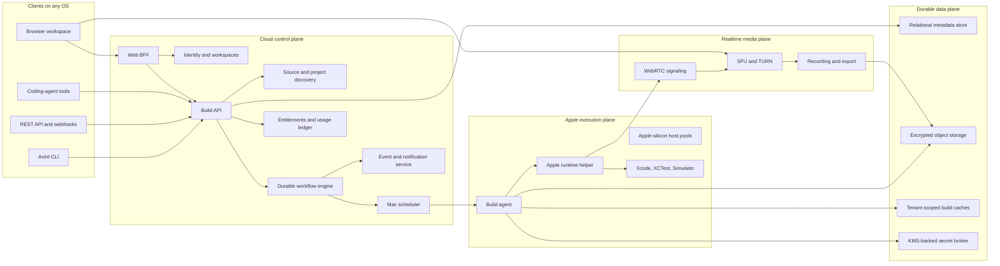
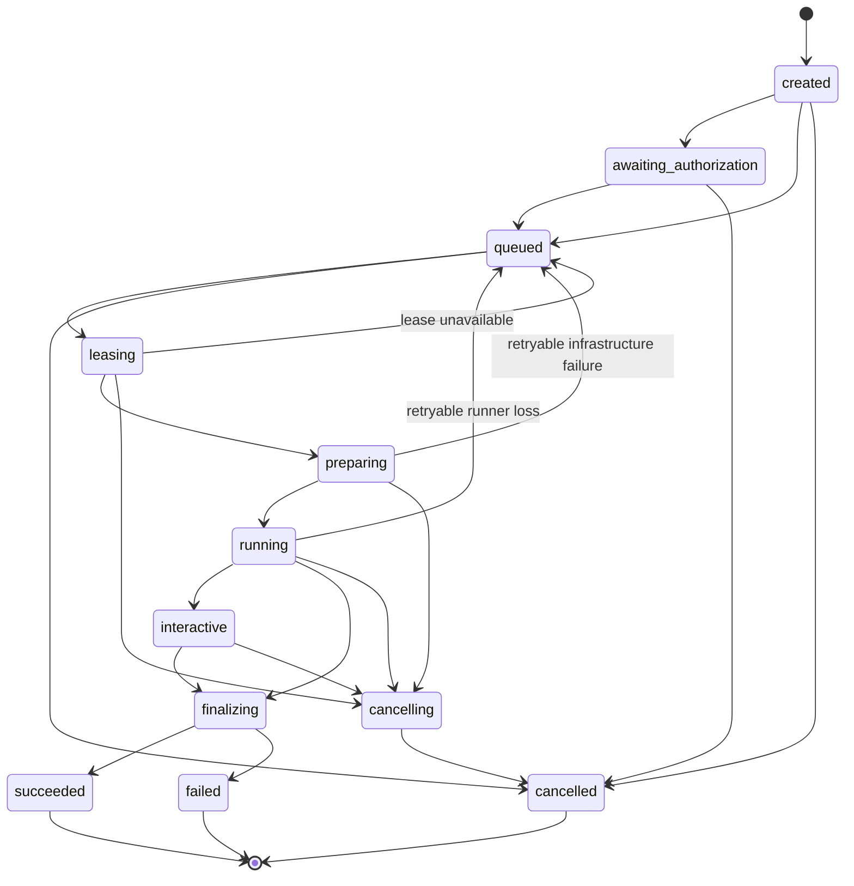

# Axint Cloud Build

## Product vision and implementation specification

**Status:** Build-ready vision and engineering contract<br>
**Audience:** Product, design, application engineering, infrastructure, security,
and coding agents contributing to Axint Cloud<br>
**Product surface:** [axint.ai/cloud/preview](https://axint.ai/cloud/preview)<br>
**Last reviewed:** July 2026

---

## 1. Executive decision

Axint Cloud should let a developer on Windows, Linux, ChromeOS, a tablet, or any
modern browser build and run a real Apple application without owning or
configuring a Mac.

The client may run anywhere. Apple compilation does not. Real iOS, iPadOS,
macOS, watchOS, tvOS, and visionOS builds must execute remotely on managed Apple
hardware with a compatible macOS, Xcode, SDK, and Simulator toolchain. Axint's
job is to make that constraint disappear behind a fast, secure, understandable
product workflow.

The product promise is:

> Connect or upload a project, choose what to run, and receive a real Xcode
> build, an interactive browser preview, durable proof, and an exact repair
> path from any computer.

Axint Cloud is not merely hosted CI and not merely a remote desktop. Its durable
advantage is the closed loop:

1. Understand the Apple project.
2. Select a reproducible toolchain.
3. Build and test with real Xcode.
4. Launch the actual app in a Simulator or controlled macOS session.
5. Stream that session to the browser.
6. Capture structured build, test, runtime, accessibility, and interaction
   evidence.
7. Return a compact proof receipt or repair packet.
8. Let a human or coding agent apply a fix and rerun the same proof.

The unit of value is not a compute minute. It is a running app with trustworthy
evidence.

---

## 2. Product principles

These principles are requirements, not aspirations.

### 2.1 Real Apple tools decide the result

- Xcode, `xcodebuild`, XCTest, Simulator, `simctl`, and `.xcresult` evidence are
  authoritative.
- Static analysis may explain and prioritize a failure, but it must not
  contradict a passing compiler or test result without explicitly labeling the
  finding advisory.
- Every result names the exact source commit, toolchain image, destination, and
  command that produced it.

### 2.2 Any client, Apple execution

- Browser, CLI, REST API, webhook, and agent integrations are first-class
  clients of the same build service.
- A Windows or Linux developer must never be told to finish a required step in
  local Xcode.
- Apple-only work is performed by the remote execution plane and returned as
  browser controls, downloadable artifacts, or repository status.

### 2.3 Secure by construction

- Repositories and their build scripts are untrusted code.
- A build cannot share a writable filesystem, keychain, process namespace,
  credentials, or tenant cache with another customer.
- Repository tokens exist only long enough to fetch a pinned commit and are not
  available to project scripts.
- Signing credentials are never exposed to ordinary build or preview jobs.

### 2.4 Read-only before write-enabled

- Connecting a repository grants selected-repository, read-only access by
  default.
- Axint may create a branch or pull request only after an explicit user action
  and an authorization check for that exact repository.
- Axint never pushes directly to a protected branch.

### 2.5 Reconnectable by default

- Closing a tab, losing a network connection, restarting an API process, or
  losing a runner connection must not lose the job.
- Every long-running operation has a durable ID, lease, heartbeat, event log,
  cancellation path, and terminal state.
- Retries are idempotent and never double-charge or create duplicate pull
  requests.

### 2.6 Evidence is a product surface

- Logs are useful raw material, not the primary result.
- Build receipts, test summaries, screenshots, recordings, crash traces,
  accessibility snapshots, screen maps, and repair packets share one artifact
  manifest.
- A human can understand the result quickly; an agent can consume the same
  result without reading megabytes of console output.

### 2.7 Privacy is explicit

- Source is processed to provide the requested service, not used to train or
  improve models by default.
- Product-learning data is source-free unless a user deliberately shares a
  specific artifact or feedback packet.
- Retention, sharing, and deletion controls are visible at workspace and job
  level.

### 2.8 The product degrades honestly

- If no Mac capacity is available, show a queue and an estimated start time.
- If streaming fails but the build succeeds, preserve the successful build and
  offer a reconnect or screenshot fallback.
- If the runner fails, label the result as infrastructure failure rather than
  blaming the app.
- Fixtures and sample recordings are always labeled as samples. They are never
  presented as a live hosted run.

---

## 3. What Axint Cloud is and is not

### It is

- Hosted Apple build and test execution.
- A browser-accessible iOS and iPadOS Simulator experience.
- A reproducible build record tied to a commit.
- A proof-and-repair layer for humans and coding agents.
- A repository check, interactive development loop, and release pipeline that
  can share the same underlying execution service.
- A way for developers without a Mac to create and ship Apple software.

### It is not

- An attempt to run Xcode natively on Windows or Linux.
- A generic Linux container builder with Apple branding.
- A full remote macOS desktop as the primary experience.
- An autonomous code-writing system that changes private repositories without
  consent.
- A replacement for App Review, Apple Developer Program membership, signing
  ownership, or the user's legal responsibility for the app.
- A promise that Simulator behavior is identical to every physical device.

---

## 4. Users and jobs to be done

### 4.1 Independent builder without a Mac

**Need:** Build an iOS app from Windows or Linux, see it run, download proof,
and know what to fix.

**Success:** The developer connects a repo, accepts detected project settings,
and reaches a running browser Simulator without learning Mac administration.

### 4.2 Developer using a coding agent

**Need:** Give an agent real Apple build feedback instead of asking it to infer
correctness from source.

**Success:** The agent starts a build, waits on durable status, reads a compact
repair packet, changes the smallest relevant files, and reruns the same job
definition.

### 4.3 Existing Apple team

**Need:** Share an exact app state, reproduce a failure, and turn a pull request
into a reviewable proof artifact.

**Success:** Every pull request can carry a build verdict, focused test result,
recording, and secure view-only preview link.

### 4.4 Product designer or stakeholder

**Need:** Review a real feature without Xcode, TestFlight setup, or local source.

**Success:** A view-only link opens quickly, identifies the commit and device,
and permits safe interaction or a guided recording.

### 4.5 Release engineer

**Need:** Produce an archive, validate signing, upload to TestFlight, and retain
an auditable release receipt.

**Success:** Signing runs in a separate high-trust lane, every credential use is
audited, and the resulting archive is traceable to source and toolchain inputs.

---

## 5. Scope and platform matrix

The platform should grow in deliberate layers. Breadth must not come at the
expense of a dependable first workflow.

| Capability | Initial production | Next | Later |
| --- | --- | --- | --- |
| Native `.xcodeproj` and `.xcworkspace` | Build, test, preview | Optimize | Maintain |
| Swift Package projects | Build and test | Executable preview | Maintain |
| iOS Simulator | Full interactive path | More runtimes | Physical devices |
| iPadOS Simulator | Full interactive path | More form factors | Physical devices |
| macOS apps | Build and test | Interactive app window | Notarized distribution |
| visionOS Simulator | Preflight and build | Interactive preview | Device lab |
| watchOS and tvOS | Preflight and build | Simulator test | Interactive preview |
| CocoaPods | Opt-in install recipe | First-class cache | Maintain |
| Tuist and XcodeGen | Explicit bootstrap recipe | Auto-detection | Maintain |
| React Native and Capacitor | Known recipe | First-class | Maintain |
| Flutter | Known recipe | First-class | Maintain |
| Kotlin Multiplatform | Build recipe | First-class | Maintain |
| Unity-generated Xcode projects | Import and build | Guided recipe | Maintain |
| Unsigned Simulator build | Full support | Maintain | Maintain |
| Signed archive | Private pilot | General availability | Maintain |
| TestFlight upload | Private pilot | General availability | Release automation |

Initial production means the capability is supported, monitored, documented,
and covered by a representative fixture. A visible option must not appear in
the product before it meets that standard.

---

## 6. Core user journeys

### 6.1 Git repository to running app

1. User signs in.
2. User installs the Axint GitHub App on selected repositories.
3. Axint lists only repositories visible to both the user and the installation.
4. User selects repository, branch, and commit.
5. Axint performs a source-only discovery pass and detects project containers,
   schemes, package managers, supported destinations, and likely app targets.
6. User confirms or adjusts the detected configuration.
7. Axint shows the resolved toolchain, estimated queue time, cost or minute
   estimate, secret policy, and commands that will run.
8. User starts the build.
9. The browser displays durable phases and live structured logs.
10. On success, Axint boots the Simulator, installs the app, launches it, and
    attaches the stream.
11. The user interacts, records, captures screenshots, or starts a safe
    walkthrough.
12. Axint produces a proof receipt and artifact manifest.
13. If a step fails, Axint produces a repair packet and offers an exact rerun.

### 6.2 Local folder from Windows or Linux

1. User installs the Axint CLI.
2. `axint cloud inspect .` creates a local manifest without uploading source.
3. The CLI applies `.gitignore`, `.axintignore`, secret detection, size limits,
   symlink checks, and archive traversal protection.
4. The CLI shows the exact file count, byte count, ignored paths, detected
   project, and secret warnings.
5. With explicit confirmation, `axint cloud build .` uploads a content-addressed
   encrypted source bundle.
6. The upload completes through resumable chunks and returns a source snapshot
   ID.
7. The normal build workflow runs against that immutable snapshot.
8. Source expires under the workspace retention policy and can be deleted
   immediately from the job page or CLI.

The local-folder flow is essential. GitHub must be the best-integrated source,
not the only source.

### 6.3 Pull request proof

1. A pull request webhook creates an idempotent build request keyed by
   repository, head SHA, workflow, and configuration hash.
2. Axint reports `queued`, `in_progress`, or `completed` through a GitHub check.
3. The check contains the concise verdict and a link to the full receipt.
4. Forked pull requests run without workspace secrets and without signing.
5. A changed-files policy can run focused tests first and a full suite when the
   branch is eligible.
6. Re-running the check creates a new attempt under the same logical build.

### 6.4 Agent repair loop

1. An agent calls `cloud.build.create` with a repository, commit, and saved
   build profile.
2. The API returns immediately with a durable build ID.
3. The agent subscribes to events or polls with exponential backoff.
4. On failure, the agent requests the compact repair packet rather than the
   full log.
5. The packet includes confirmed evidence, probable causes, advisory findings,
   likely files, exact rerun command, and artifact references.
6. With explicit repository write authorization, the agent creates a repair
   branch and pull request.
7. Axint limits automated repair attempts and stops when evidence repeats,
   confidence drops, or a policy requires a human.

### 6.5 Signed release

1. Workspace administrator configures an Apple team connection and a protected
   release profile.
2. A user with release permission selects a trusted branch or tag.
3. Axint verifies branch protection, source provenance, signing policy, and
   required passing checks.
4. The signing lane receives only the immutable source snapshot and required
   release credentials.
5. Axint archives and exports the app, validates the signature, and optionally
   uploads through an Apple-supported distribution path.
6. The system records an audit event for every credential read, archive, export,
   upload, and user approval.

---

## 7. Experience specification

### 7.1 The first screen

The primary screen is the build workspace, not a marketing page. It contains:

- Source selector: Git provider or local upload.
- Repository, branch, and commit selector.
- Detected project container and scheme.
- Platform, device, runtime, architecture, and toolchain.
- Build profile: Preview, Test, Archive, or Custom.
- Read-only summary of commands, secrets, and network access.
- Estimated queue time and usage.
- One primary action: **Build and preview**.

The form should progressively disclose advanced configuration. A first-time
user should normally accept detection and press one button.

### 7.2 Build workspace layout

Desktop layout:

- Left rail: source, configuration, run history, and saved profiles.
- Center: Simulator or macOS app stream.
- Right inspector: phases, repair packet, artifacts, and session details.
- Bottom drawer: structured logs, test results, and console output.

Mobile and narrow layout:

- Simulator first.
- Tabs for Build, Repair, Artifacts, and Session.
- Controls remain reachable without covering the app viewport.

### 7.3 Phase presentation

Users should see stable phases, each with start time, duration, status, and
focused output:

1. Source authorized
2. Snapshot created
3. Project discovered
4. Mac allocated
5. Toolchain selected
6. Dependencies restored
7. Build completed
8. Tests completed
9. Simulator booted
10. App installed
11. App launched
12. Stream attached
13. Evidence finalized

Phases that do not apply are marked `skipped` with a reason. A phase may expose
substeps, but dynamic substeps must never resize or reorder the primary phase
list.

### 7.4 Failure presentation

Every failure page answers five questions in this order:

1. What failed?
2. Is this the app, the project configuration, or Axint infrastructure?
3. What evidence proves that classification?
4. What is the smallest next action?
5. What exact action reruns the failed proof?

The default view shows a compact failure excerpt. Full logs remain searchable
and downloadable.

### 7.5 Collaboration

- Roles: owner, admin, developer, reviewer, billing.
- Session permissions: owner, controller, collaborator, view-only.
- Only one participant controls raw pointer input at a time.
- Control can be requested, granted, revoked, and audited.
- Shared links are scoped to one build or session, expire, and can be revoked.
- A view-only link must not expose source, secrets, hidden logs, runner
  addresses, or internal identifiers.

### 7.6 Accessibility

- Full keyboard navigation for configuration, logs, tabs, and simulator
  controls.
- Visible focus and a logical focus order.
- Status is conveyed by text and icon, never color alone.
- Build announcements use polite live regions; failures use assertive
  announcements only once.
- Streaming controls expose names, state, and shortcuts to assistive
  technologies.
- The browser Simulator supports a semantic interaction mode based on the
  app's accessibility tree.
- Reduced-motion mode removes nonessential movement without reducing status
  clarity.
- Contrast meets WCAG 2.2 AA at minimum.

---

## 8. Target architecture

### 8.1 System overview



### 8.2 Architectural boundaries

#### Web application

The `axint.ai` application owns presentation, browser session handling, and a
thin backend-for-frontend layer. It must not execute `git`, `xcodebuild`,
Simulator, package managers, or arbitrary project commands. It does not store
runner credentials in browser-visible objects.

#### Identity, billing, and workspace service

The Registry service already owns GitHub-backed identity, Cloud workspaces,
entitlements, and Stripe foundations. Keep those responsibilities there. Add
fine-grained build roles, source connections, usage dimensions, and audit logs
without moving build execution into the Registry worker.

#### Cloud build control service

Create a private service dedicated to builds and sessions. It owns:

- Public build API.
- Build profiles and configuration validation.
- Source snapshots.
- Durable workflow state.
- Scheduler and runner leases.
- Event ordering.
- Artifact manifests.
- Cancellation and retry policy.
- Stream-session authorization.

This service should use a relational database for durable state and a workflow
engine for long-running orchestration. A durable workflow platform such as
[Temporal](https://docs.temporal.io/) is the recommended default because build
jobs must survive process failure, wait on external runners, heartbeat long
activities, retry infrastructure steps, and respond to cancellation. A
carefully implemented queue plus database state machine can work, but it must
provide the same guarantees before production.

#### Apple execution plane

The execution plane is a private network of Apple-silicon Mac hosts. Each host
runs two cooperating processes:

- **Build agent:** A headless TypeScript service that claims leases, fetches
  source, executes declared build plans, invokes Axint proof logic, uploads
  artifacts, and reports events.
- **Apple runtime helper:** A signed Swift service with the minimum permissions
  required for ScreenCaptureKit, VideoToolbox, Simulator window control, and
  host health. It listens only on a local Unix domain socket and never accepts
  public network traffic.

This split reuses Axint's TypeScript proof and repair code while keeping
Apple-framework integration in Swift.

#### Media plane

Use WebRTC for hosted interactive sessions. Do not build a production SFU,
TURN service, browser compatibility layer, and recording pipeline from scratch.
LiveKit is the recommended initial transport because it supports browser and
Swift clients, realtime video and data, selective delivery, recording, TURN,
and managed or self-hosted deployment. The dependency remains behind an Axint
`MediaProvider` interface so enterprise deployments can change providers.

#### Artifact plane

Screenshots, recordings, logs, `.xcresult` bundles, archives, receipts, and
repair packets belong in encrypted object storage. Metadata and hashes belong
in the relational store. Large images or logs must never be embedded in a job
row or Redis value.

---

## 9. Mac capacity and isolation strategy

### 9.1 Recommended deployment sequence

1. **Development:** One dedicated development Mac and one clean runner image.
2. **Private pilot:** At least two production hosts plus one spare or drainable
   development host in one region.
3. **General availability:** Separate build and interactive-preview pools,
   capacity alarms, automated quarantine, and a tested provider failover path.
4. **Enterprise:** Dedicated pools, regional placement, custom retention, and
   customer-specific egress policy.

### 9.2 Provider recommendation

Start with dedicated or colocated Mac minis, or a dedicated Mac hosting vendor
that allows image control and low-latency networking. Keep a provider adapter
so AWS EC2 Mac can serve as an overflow or enterprise deployment option.

AWS is not the ideal sole provider for bursty preview traffic: EC2 Mac uses one
bare-metal instance per Dedicated Host, has a 24-hour minimum host allocation,
and documents multi-minute launch times. It remains valuable for AWS-native
customers, regional controls, EBS-backed images, and mature infrastructure
APIs.

### 9.3 Isolation decision

Treat arbitrary repositories as hostile. The target boundary is one disposable
macOS virtual machine per active tenant job on Apple hardware, with an immutable
base image and a fresh writable disk.

Before choosing a VM runtime, complete a measured technical spike that proves:

- Supported macOS and Xcode versions boot reliably.
- iOS and iPadOS Simulator rendering works inside the guest.
- ScreenCaptureKit capture and hardware video encoding meet latency targets.
- XCTest and UI automation remain stable.
- VM teardown removes source, credentials, keychain material, DerivedData, and
  process state.
- The configuration complies with current Apple agreements and host licensing.

Apple's Virtualization framework provides supported APIs for macOS guests on
Apple silicon, but Simulator performance and any nested virtualization behavior
must be proven with the exact image and host class.

If the VM spike does not meet the preview target, the safe fallback is a
single-tenant whole-host lease for each untrusted job. Do not place unrelated
customer jobs on one bare host and treat Unix users, containers, or temporary
directories as a sufficient security boundary.

### 9.4 Pool classes

| Pool | Workload | Credentials | Network | Session length |
| --- | --- | --- | --- | --- |
| Discovery | Source-only project inspection | Read-only source token | Restricted | Short |
| Build | Unsigned build and tests | No signing material | Dependency policy | Medium |
| Preview | Build plus interactive Simulator | No signing material | Dependency plus media | Medium/long |
| Signing | Archive, export, upload | Scoped release credentials | Apple endpoints | Short/medium |
| Dedicated | Enterprise-specific | Customer policy | Customer policy | Contracted |

Signing capacity is never reused as an ordinary untrusted preview worker
without full image replacement and key destruction.

### 9.5 Capacity model

Track arrival rate, queue wait, service duration, warm capacity, and utilization
per pool and toolchain. The scheduler should target 65-75% sustained utilization
so interactive jobs can start quickly and a host can be quarantined without
exhausting the fleet.

Required scheduler behavior:

- Reserve a small warm pool for interactive sessions.
- Bin-pack only when the isolation model explicitly permits it.
- Prefer a host that already has the requested immutable toolchain image.
- Avoid moving an active stream.
- Drain hosts before macOS or Xcode updates.
- Quarantine a host after repeated Simulator, disk, keychain, or runner-health
  failures.
- Publish an honest queue estimate based on current leases and observed
  durations.

---

## 10. Toolchain image system

### 10.1 Never hardcode the latest toolchain in product code

The service maintains a signed image catalog. User-facing aliases resolve to an
immutable image at job creation:

- `stable`
- `previous`
- `beta`
- `stable-plus-beta-runtime`
- explicit Xcode build identifier

The resolved image never changes during a job or rerun. A receipt records both
the requested alias and resolved identifiers.

### 10.2 Image manifest

Each runner image publishes:

```json
{
  "imageId": "img_01JAXINTAPPLE001",
  "imageDigest": "sha256:2c56b8d98e08f0f9d9324f722c3cb2cc9f1d9ae31e286f304f8994ad70c26ed1",
  "channel": "stable",
  "hostArchitecture": "arm64",
  "macOS": {
    "productVersion": "resolved-at-image-build",
    "buildVersion": "resolved-at-image-build"
  },
  "xcode": {
    "path": "/Applications/Xcode.app",
    "marketingVersion": "resolved-at-image-build",
    "buildVersion": "resolved-at-image-build",
    "licenseAccepted": true,
    "firstLaunchCompleted": true
  },
  "runtimes": [
    {
      "platform": "iOS",
      "version": "resolved-at-image-build",
      "build": "resolved-at-image-build",
      "identifier": "resolved-at-image-build"
    }
  ],
  "tools": {
    "swift": "resolved-at-image-build",
    "ruby": "resolved-at-image-build",
    "node": "resolved-at-image-build",
    "python": "resolved-at-image-build"
  },
  "createdAt": "image-build-timestamp",
  "testedFixtureSet": "apple-runner-conformance"
}
```

Values are populated by the image builder. They are not copied from marketing
pages.

### 10.3 Image promotion

1. Build image in `candidate`.
2. Run host-health, compiler, Simulator, UI automation, streaming, recording,
   dependency, and cleanup conformance suites.
3. Run representative fixture projects.
4. Soak the image on internal traffic.
5. Promote the immutable digest to `stable` or `beta` alias.
6. Keep at least one prior healthy stable image available for rollback.

Beta images are isolated from stable capacity and carry no reliability promise
beyond the explicitly published beta policy.

### 10.4 Runtime inventory

Runner inventory is discovered with Apple tools and posted to the control
plane. The browser shows only combinations that exist on healthy capacity.
Apple documents command-line installation of Xcode components and Simulator
runtimes; image construction should use those supported mechanisms and run
`xcodebuild -runFirstLaunch` before promotion.

---

## 11. Durable build lifecycle

### 11.1 State machine



### 11.2 Logical build versus attempt

- **Build:** User intent tied to source, configuration, and idempotency key.
- **Attempt:** One execution of that build on a runner.
- **Phase:** A named unit of progress within an attempt.
- **Event:** An immutable ordered fact emitted by the control plane or runner.

An infrastructure retry creates a new attempt under the same build. A source or
configuration change creates a new build.

### 11.3 Terminal classifications

| Classification | Meaning | Automatic retry |
| --- | --- | --- |
| `success` | Requested proof completed | No |
| `project_failure` | Source, dependency, compile, test, launch, or policy failure | Only when user changes input |
| `infrastructure_failure` | Runner, host, storage, network, or service failure | Yes, bounded |
| `cancelled` | User or policy requested stop | No |
| `timed_out` | A declared deadline expired | Only when policy allows |
| `quota_blocked` | Entitlement or workspace budget prevented start | No charge |

### 11.4 Lease protocol

- Scheduler creates a short lease for one attempt and one runner capability
  set.
- Runner claims the lease with workload identity, not a long-lived shared
  secret.
- Runner heartbeats include attempt ID, phase, process health, disk, memory,
  toolchain digest, Simulator state, and last event sequence.
- Missed heartbeats move the attempt to `suspect`, then expire the lease.
- A replacement attempt starts only after the old lease cannot publish valid
  events.
- Event writes require attempt-scoped credentials and monotonically increasing
  sequence numbers.

### 11.5 Cancellation

Cancellation must:

1. Mark the build `cancelling` durably.
2. Notify the workflow and runner.
3. Terminate the entire process group, not only `xcodebuild`.
4. Stop recordings and streams.
5. Finalize partial logs and artifacts.
6. Revoke source, stream, and secret leases.
7. Destroy the workspace.
8. Finalize usage at the last billable second.
9. End in `cancelled`, even when cleanup reports a separate infrastructure
   incident.

---

## 12. Build pipeline

### 12.1 Source authorization

- Verify the signed-in user can access the selected workspace.
- Verify the GitHub App installation covers the selected repository.
- Resolve branch or tag to an immutable commit SHA.
- Mint an installation token scoped to repository contents read access.
- Do not use passwords or personal access tokens.
- Revoke or discard the token immediately after source acquisition.

### 12.2 Source snapshot

- Fetch the exact commit without running hooks.
- Apply submodule and Git LFS policy explicitly.
- Reject local-network URLs, unsafe protocols, path traversal, unsafe symlinks,
  and oversized objects.
- Record commit, tree, submodule SHAs, LFS object identities, and snapshot hash.
- Store an encrypted content-addressed snapshot when retention policy permits.
- Remove repository credentials before any project script runs.

### 12.3 Project discovery

Discovery returns candidates rather than guessing silently:

- `.xcworkspace`
- `.xcodeproj`
- `Package.swift`
- shared schemes
- app, test, UI test, extension, widget, watch, and vision targets
- deployment targets
- Swift language mode
- package managers and generators
- required environment keys by name, never value
- candidate Simulator destinations
- likely app bundle identifier

Use structured output such as `xcodebuild -list -json` and
`xcodebuild -showBuildSettings -json` where available. Parse project files with
structured tooling; do not infer critical settings from log text.

When multiple app schemes are valid, the UI requires a choice and explains the
difference.

### 12.4 Preflight

- Validate the requested toolchain and destination exist.
- Validate disk, memory, and timeout budgets.
- Validate project path remains inside the snapshot.
- Validate the build profile against workspace policy.
- Detect dependency credentials that are required but absent.
- Display custom bootstrap commands before the first run.
- For signing, verify the protected release policy before allocating a signing
  worker.

### 12.5 Dependency restore

- Swift Package Manager, CocoaPods, Ruby, Node, and other dependencies run under
  an explicit network policy.
- Dependency caches are immutable or tenant-scoped.
- Cache keys include dependency lockfiles, architecture, tool version, and
  toolchain image digest.
- A cache is verified before use and never contains repository source or
  credentials.
- Private package credentials are scoped to the specific host and dependency
  domain, injected only for restore, then revoked.
- A dependency failure is reported separately from an Xcode compile failure.

### 12.6 Xcode execution

Each Xcode invocation is represented as an argument array, not a shell string.
The runner records the rendered command for humans after redacting secrets.

Required properties:

- Explicit project or workspace.
- Explicit shared scheme.
- Explicit destination.
- Explicit configuration.
- Explicit DerivedData path inside the job workspace.
- Explicit result bundle path.
- Explicit timeout and idle timeout.
- Disabled signing for Simulator-only workflows unless a target genuinely
  requires it.
- Process-group management and cancellation.
- Streaming stdout and stderr with bounded in-memory buffers.

Representative unsigned build:

```bash
xcodebuild \
  -workspace App.xcworkspace \
  -scheme App \
  -configuration Debug \
  -destination "platform=iOS Simulator,name=iPhone 17 Pro,OS=latest" \
  -derivedDataPath /workspace/DerivedData \
  -resultBundlePath /workspace/Artifacts/build.xcresult \
  CODE_SIGNING_ALLOWED=NO \
  build
```

The actual destination is resolved from the image inventory. `OS=latest` in a
saved profile resolves to a concrete runtime in the receipt.

### 12.7 Test execution

- Support build-for-testing plus test-without-building for a destination
  matrix.
- Allow focused selectors and full suites.
- Retry only tests labeled retryable by policy; retain every attempt.
- Never convert a flaky retry pass into an unqualified clean pass. Report the
  original failure and final outcome.
- Classify XCTest infrastructure failures separately from app assertions.
- Parse `.xcresult` into structured test suites, durations, failures,
  attachments, source locations, and coverage artifacts.

### 12.8 Simulator launch

1. Create or select a clean device from the resolved runtime.
2. Boot and wait for readiness with `simctl bootstatus`.
3. Install the built `.app`.
4. Launch by bundle identifier with a clean argument and environment policy.
5. Confirm the process remains alive and the first frame arrives.
6. Capture console and crash evidence.
7. Publish stream readiness only after the browser can receive media.

Simulator devices are erased or destroyed between tenants. A warm base device
may be cloned only if the clone mechanism is proven to remove prior tenant
state.

### 12.9 Finalization

- Parse and classify evidence.
- Generate proof receipt and repair packet.
- Hash every retained artifact.
- Upload artifacts before releasing the runner.
- Finalize usage with an idempotent ledger transaction.
- Delete source and workspace according to retention policy.
- Publish one terminal event.

---

## 13. Project configuration

### 13.1 Configuration precedence

1. Explicit API request overrides.
2. Saved workspace build profile.
3. Repository `.axint/cloud.yml`.
4. Project discovery.
5. Platform defaults.

The resolved configuration is stored with the build. Rerun means rerun that
resolved configuration, not reinterpret moving defaults.

### 13.2 Example `.axint/cloud.yml`

```yaml
schema: https://axint.ai/schemas/cloud-project.v1.json

project:
  root: .
  container: App.xcworkspace
  scheme: App
  configuration: Debug

toolchain:
  xcode: stable
  hostArchitecture: arm64

destination:
  platform: iOS Simulator
  device: iPhone 17 Pro
  runtime: latest

bootstrap:
  networkPolicy: dependencies
  commands:
    - name: Install Ruby dependencies
      executable: /usr/bin/env
      arguments: [bundle, install, --jobs, "4", --retry, "2"]
      timeoutSeconds: 600
    - name: Install pods
      executable: /usr/bin/env
      arguments: [bundle, exec, pod, install]
      timeoutSeconds: 900

build:
  action: build
  codeSigning: disabled
  timeoutSeconds: 1800
  idleTimeoutSeconds: 300

tests:
  enabled: true
  selectors:
    - AppTests
    - AppUITests/OnboardingTests
  retryPolicy:
    infrastructureAttempts: 2
    testAttempts: 1

preview:
  enabled: true
  mode: fast
  launchArguments: []
  environment:
    AXINT_PREVIEW_MODE: "1"
  sessionTimeoutSeconds: 1800

artifacts:
  retainDays: 14
  include:
    - xcresult
    - logs
    - screenshots
    - recording
    - proof
    - repair-packet

network:
  allowedDependencyHosts:
    - github.com
    - api.github.com
    - objects.githubusercontent.com
    - githubusercontent.com
    - cdn.cocoapods.org
  denyPrivateNetworks: true

secrets:
  allowed:
    - PRIVATE_PACKAGE_TOKEN
  exposeToPullRequestsFromForks: false
```

### 13.3 Configuration rules

- Unknown fields fail validation in CI mode and warn in interactive draft mode.
- Secret names are allowed in repository configuration; values are not.
- Commands are executable plus argument arrays.
- Project paths resolve inside the source root after symlink resolution.
- Network policy is additive to platform-required endpoints and cannot disable
  metadata-service blocking.
- The UI displays repository-defined commands before the first execution.
- Workspace policy can forbid custom commands, network hosts, beta toolchains,
  signing, or long sessions.

---

## 14. Public API contract

### 14.1 Conventions

- Base path: `/api/v1`.
- JSON request and response bodies.
- Bearer API tokens for CLI and integrations; secure HttpOnly sessions for the
  browser.
- `Idempotency-Key` required on create, retry, cancellation, billing, and
  repository-write actions.
- Cursor pagination.
- RFC 3339 timestamps in UTC.
- Stable machine codes plus human messages.
- Request IDs on every response.
- No runner credentials, internal hostnames, source tokens, secret values, or
  raw storage keys in public DTOs.

### 14.2 Core endpoints

| Method | Endpoint | Purpose |
| --- | --- | --- |
| `GET` | `/toolchains` | Available resolved toolchains and destinations |
| `GET` | `/source-connections` | Authorized Git provider installations |
| `GET` | `/repositories` | Repositories available to the current user/workspace |
| `POST` | `/source-snapshots` | Create a repository or upload snapshot |
| `POST` | `/projects/discover` | Inspect a snapshot and return project candidates |
| `POST` | `/builds` | Create a logical build |
| `GET` | `/builds/{buildId}` | Read current build state |
| `GET` | `/builds/{buildId}/events` | SSE event stream with replay cursor |
| `POST` | `/builds/{buildId}/cancel` | Cancel the active attempt |
| `POST` | `/builds/{buildId}/retry` | Start an eligible new attempt |
| `GET` | `/builds/{buildId}/artifacts` | Read artifact manifest |
| `GET` | `/builds/{buildId}/repair-packet` | Read compact repair contract |
| `POST` | `/builds/{buildId}/fix-branches` | Create an explicitly authorized fix branch |
| `POST` | `/sessions/{sessionId}/tokens` | Mint scoped viewer/controller media token |
| `POST` | `/sessions/{sessionId}/commands` | Reliable semantic or control command |
| `POST` | `/sessions/{sessionId}/recordings` | Start recording |
| `POST` | `/sessions/{sessionId}/recordings/stop` | Stop and finalize recording |
| `POST` | `/secrets` | Add an encrypted workspace secret |
| `GET` | `/usage` | Workspace usage and budget state |

### 14.3 Create build request

```json
{
  "workspaceId": "ws_01JAXINTWORKSPACE",
  "source": {
    "type": "github",
    "installationId": "ghinst_123456",
    "repository": "example/App",
    "ref": "refs/heads/main",
    "commitSha": "0123456789abcdef0123456789abcdef01234567"
  },
  "profile": "preview",
  "project": {
    "root": ".",
    "container": "App.xcworkspace",
    "scheme": "App",
    "configuration": "Debug"
  },
  "toolchain": {
    "xcode": "stable"
  },
  "destination": {
    "platform": "iOS Simulator",
    "device": "iPhone 17 Pro",
    "runtime": "latest"
  },
  "tests": {
    "enabled": true,
    "selectors": ["AppTests"]
  },
  "preview": {
    "enabled": true,
    "mode": "fast",
    "sessionTimeoutSeconds": 1800
  }
}
```

### 14.4 Create build response

```json
{
  "build": {
    "id": "bld_01JAXINTBUILD001",
    "status": "queued",
    "classification": null,
    "workspaceId": "ws_01JAXINTWORKSPACE",
    "source": {
      "repository": "example/App",
      "commitSha": "0123456789abcdef0123456789abcdef01234567"
    },
    "resolvedToolchain": {
      "requested": "stable",
      "imageId": "img_01JAXINTAPPLE001",
      "imageDigest": "sha256:2c56b8d98e08f0f9d9324f722c3cb2cc9f1d9ae31e286f304f8994ad70c26ed1"
    },
    "queue": {
      "position": 1,
      "estimatedStartAt": "2026-07-14T20:31:00Z"
    },
    "createdAt": "2026-07-14T20:30:00Z",
    "links": {
      "self": "/api/v1/builds/bld_01JAXINTBUILD001",
      "events": "/api/v1/builds/bld_01JAXINTBUILD001/events",
      "workspace": "/cloud/builds/bld_01JAXINTBUILD001"
    }
  }
}
```

### 14.5 Event envelope

```json
{
  "id": "evt_01JAXINTEVENT001",
  "buildId": "bld_01JAXINTBUILD001",
  "attemptId": "att_01JAXINTATTEMPT1",
  "sequence": 42,
  "type": "phase.completed",
  "occurredAt": "2026-07-14T20:33:15Z",
  "data": {
    "phase": "build",
    "status": "passed",
    "durationMs": 48213,
    "summary": "App compiled for the resolved iOS Simulator destination."
  }
}
```

SSE supports `Last-Event-ID`; reconnect returns missed events in order. The
current build snapshot remains authoritative when a client has missed compacted
log events.

### 14.6 Error envelope

```json
{
  "error": {
    "code": "TOOLCHAIN_UNAVAILABLE",
    "message": "The requested beta toolchain has no healthy capacity in this region.",
    "retryable": true,
    "requestId": "req_01JAXINTREQUEST1",
    "details": {
      "requestedChannel": "beta",
      "availableChannels": ["stable", "previous"]
    }
  }
}
```

---

## 15. Internal runner protocol

The runner protocol is private and distinct from the public API.

### 15.1 Runner identity

- Each host has workload identity issued by the infrastructure environment.
- Each agent binary is signed and reports its build digest.
- Control-plane trust requires host identity, healthy image digest, attested
  agent version, and an active lease.
- Long-lived shared bearer tokens are prohibited.

### 15.2 Runner capabilities

```json
{
  "runnerId": "run_apple_usw2_0042",
  "region": "us-west",
  "pool": "preview",
  "architecture": "arm64",
  "imageId": "img_01JAXINTAPPLE001",
  "capabilities": [
    "xcodebuild",
    "xcresult",
    "ios-simulator",
    "ipad-simulator",
    "screen-capture-kit",
    "video-toolbox-h264",
    "webrtc",
    "recording",
    "semantic-accessibility"
  ],
  "capacity": {
    "jobs": 1,
    "interactiveSessions": 1
  }
}
```

### 15.3 Required internal operations

- Register and heartbeat.
- Claim, renew, and release lease.
- Fetch encrypted source snapshot with attempt-scoped URL.
- Fetch permitted secrets through the secret broker.
- Publish ordered events.
- Upload artifacts with content hash and media type.
- Open and close a media session.
- Receive cancellation.
- Report cleanup proof and host health.

### 15.4 Event durability

The runner writes events to a local append-only spool before sending them. If
the control plane is unavailable, it retries from the last acknowledged
sequence. Log chunks may be compacted after artifact upload; state transitions
and artifact registrations are retained.

---

## 16. Data model

Use a relational database for ownership and durable state, object storage for
large artifacts, and the workflow engine for orchestration history.

### 16.1 Core entities

| Entity | Required fields |
| --- | --- |
| `workspaces` | id, owner, plan, region policy, retention policy, created_at |
| `workspace_members` | workspace_id, user_id, role, status, joined_at |
| `source_connections` | id, workspace_id, provider, installation_id, encrypted metadata, status |
| `source_snapshots` | id, workspace_id, provider, repo, commit, tree hash, object key, size, expires_at |
| `projects` | id, workspace_id, source identity, detected containers, default profile |
| `build_profiles` | id, project_id, name, configuration JSON, configuration hash |
| `builds` | id, workspace_id, snapshot_id, profile snapshot, status, classification, idempotency key |
| `build_attempts` | id, build_id, number, runner lease, image digest, status, timestamps |
| `build_phases` | attempt_id, phase, status, started_at, completed_at, summary |
| `build_events` | id, attempt_id, sequence, type, payload, occurred_at |
| `runner_hosts` | id, provider, region, pool, image, state, last heartbeat, health score |
| `runner_leases` | id, runner_id, attempt_id, capability set, expires_at, released_at |
| `sessions` | id, build_id, runner lease, media room, status, controller, expires_at |
| `artifacts` | id, build_id, attempt_id, kind, object key, hash, size, media type, retention |
| `repair_packets` | id, build_id, schema version, verdict, confidence, object key, hash |
| `workspace_secrets` | id, workspace_id, name, KMS reference, allowed phases, allowed domains |
| `secret_access_events` | secret_id, attempt_id, actor, reason, occurred_at |
| `usage_ledger` | id, workspace_id, build_id, dimension, quantity, unit, price snapshot, idempotency key |
| `audit_events` | id, workspace_id, actor, action, target, metadata, occurred_at |
| `share_links` | id, session/build, scope, token hash, expires_at, revoked_at |

### 16.2 Data rules

- IDs are unguessable and do not confer authorization.
- Every tenant-owned row includes or joins unambiguously to `workspace_id`.
- Authorization is checked server-side on every read and mutation.
- Events are append-only.
- Build configuration and price are snapshotted at creation.
- Usage uses immutable ledger entries plus compensating entries, never mutable
  counters as the accounting source of truth.
- Object keys are private. Downloads use short-lived, audience-scoped URLs.
- Runner leases and media tokens are stored hashed or issued as short-lived
  signed claims.
- Deletion records remain as minimal audit tombstones when legally required.

---

## 17. Streaming and browser control

### 17.1 Video path

Recommended path:

1. Swift runtime helper selects the Simulator window or macOS app window.
2. ScreenCaptureKit emits frames as sample buffers.
3. VideoToolbox encodes H.264 using hardware acceleration when available.
4. The runner publishes the video track to a WebRTC room.
5. The browser subscribes through the nearest media edge.
6. A separate recording service writes a high-quality artifact without forcing
   the interactive stream to use recording bitrate.

ScreenCaptureKit requires system authorization. Runner images must grant and
verify this permission during image creation; a missing permission quarantines
the host.

### 17.2 Input path

Keep two distinct paths:

- **Interactive control:** Low-latency pointer, keyboard, swipe, rotate, home,
  and hardware-key events over a WebRTC data channel.
- **Semantic automation:** Reliable commands against accessibility-identified
  elements, executed by the automation driver and acknowledged with evidence.

Raw input is translated from the displayed app frame after accounting for
letterboxing, scale, orientation, safe areas, and window chrome. The browser
sends normalized coordinates plus the frame ID it observed. The runner rejects
stale or out-of-bounds input.

Reliable operations such as `tap element`, `enter text`, and `assert visible`
use a reliable data path or API command. High-frequency pointer movement may use
lossy delivery.

### 17.3 Stream profiles

| Profile | Target | Primary use |
| --- | --- | --- |
| Fast | 720p, 60 fps when possible, lowest latency | Edit and interact |
| Smooth | 1080p, 60 fps, adaptive bitrate | Motion and visual QA |
| Demo | High-quality capture plus interactive preview | Shareable walkthrough |

Profiles are targets, not fabricated metrics. The UI shows measured RTT, frame
rate, bitrate, packet loss, dropped frames, and capture-to-display latency.

### 17.4 Fallbacks

- WebRTC connection retry with ICE restart.
- TURN relay when direct UDP is unavailable.
- Lower resolution and frame rate under congestion.
- Screenshot polling as an explicitly degraded fallback.
- Build and artifacts remain usable when media is unavailable.

MJPEG or data-URL frames are acceptable for local proof and smoke tests, not the
general hosted architecture.

---

## 18. Proof, repair, and agent intelligence

### 18.1 One evidence contract

Cloud builds should reuse Axint's existing proof and repair concepts:

- verdict
- confidence
- source identity
- resolved toolchain
- command and destination
- evidence
- findings
- runner health
- next action
- rerun contract
- artifact manifest

### 18.2 Evidence confidence

Every finding is one of:

- **Confirmed:** Compiler, test, crash, runtime, or deterministic evidence
  supports the finding.
- **Probable:** Strong static or contextual evidence exists and no authoritative
  result contradicts it.
- **Advisory:** A heuristic lead requires review.
- **Suppressed:** Current authoritative evidence contradicts the rule for this
  build context.
- **Blocked:** The requested proof could not run because infrastructure or
  configuration failed.

### 18.3 Repair packet contents

- What failed and at which phase.
- App/project/infrastructure classification.
- Exact evidence excerpts and artifact references.
- Failing test, source location, and assertion where available.
- Likely files ranked by evidence, not filename guesswork.
- Smallest recommended change direction.
- Commands and configuration required to reproduce.
- What Axint did not prove.
- Exact rerun API or CLI action.

### 18.4 Safe walkthrough agent

The walkthrough system starts in a deny-by-default policy:

- No purchases.
- No posting or sending externally.
- No deleting data.
- No account or security changes.
- No permission escalation.
- No secret fields.
- No navigation to external URLs unless explicitly allowed.

The agent consumes screenshots plus accessibility state, records each action,
and produces:

- `walkthrough.mp4`
- `screen-map.json`
- `replay-flow.yaml`
- `repair-packet.md`
- `screenshots.zip`
- crash and console evidence when present

Each action includes its safety classification and evidence timestamp. A human
can stop the walkthrough immediately.

### 18.5 Automated repair limits

- No repository writes without explicit write authorization.
- Never write to the user's protected branch.
- Default maximum of two automated fix attempts per failure signature.
- Stop when the same failure repeats, the diff exceeds policy, tests regress,
  or confidence falls below the workspace threshold.
- Every generated change is a reviewable commit on a dedicated branch.

---

## 19. Security model

### 19.1 Threat model

Assume a repository may intentionally attempt to:

- Read host or other-tenant files.
- Exfiltrate repository, dependency, signing, or runner credentials.
- Reach cloud metadata services or internal networks.
- Fork processes, consume disk, memory, CPU, or network indefinitely.
- Escape through build scripts, package plugins, compilers, media codecs, or
  test runners.
- Poison shared caches.
- Publish secrets through logs, test attachments, screenshots, or artifacts.
- Keep a process alive after cancellation.
- Impersonate a runner or replay runner events.

### 19.2 Required controls

#### Identity and authorization

- Workspace-scoped authorization on every endpoint.
- Role checks for secrets, billing, sharing, writes, and releases.
- Short-lived GitHub App tokens with selected-repository access.
- Short-lived API tokens with audience and capability claims.
- SSO and SCIM for enterprise later, with the authorization model designed now.

#### Execution

- Disposable VM or whole-host isolation for untrusted jobs.
- Non-root build user.
- Resource ceilings and process-group termination.
- No inbound public ports on runners.
- Outbound control-plane connection authenticated with workload identity.
- Host firewall and network segmentation.
- Image signing, provenance, and promotion gates.

#### Network

- Block link-local metadata endpoints and private network ranges.
- Deny arbitrary inbound traffic.
- Dependency egress policy with DNS rebinding protection.
- Separate media egress from dependency egress.
- Release lanes reach only required Apple and artifact endpoints plus approved
  dependencies.

#### Secrets

- Envelope encryption through a managed KMS.
- Secret values never stored in build configuration or event payloads.
- Phase- and domain-scoped access.
- Redaction at process output, structured log, artifact, and UI boundaries.
- Audit every secret access.
- No secrets for untrusted fork builds.

#### Supply chain

- Signed runner binaries and image manifests.
- Locked dependencies and software bills of materials for control and runner
  services.
- Provenance for image creation and release artifacts.
- Automated dependency and container/image scanning.
- Emergency image revocation.

### 19.3 Source privacy

- Encrypt source in transit and at rest.
- Default source retention ends when the build retention window ends; allow an
  immediate-delete policy.
- Never expose source to the media service.
- Keep source out of analytics, error trackers, support logs, and model prompts
  unless the user explicitly shares selected content.
- Support repository and artifact deletion with a documented completion SLA.

### 19.4 Immediate production gate for the current prototype

Before arbitrary hosted repositories are enabled, complete all of the
following:

1. Separate server-only job state from the browser DTO.
2. Remove runner tokens, generated runner commands, storage keys, and internal
   host data from every client response.
3. Require an authenticated workspace owner or member for job creation, list,
   read, command, recording, walkthrough, and deletion routes.
4. Replace origin checks as the primary authorization control with session,
   CSRF, workspace role, and object ownership checks.
5. Eliminate any endpoint that lists jobs across users or workspaces.
6. Rotate prototype runner credentials after the DTO change.
7. Validate repositories against authorized provider installations; do not
   accept an arbitrary URL as sufficient authorization.
8. Prevent server-side request forgery, local path access, unsafe Git protocols,
   and redirect-to-private-network behavior.
9. Move job records to a durable transactional store and frames/artifacts to
   object storage.
10. Move runner execution out of the Next.js process.
11. Add an immutable event log, attempt leases, and bounded retries.
12. Add security integration tests for horizontal and vertical authorization.

This gate is a launch blocker, not post-launch hardening.

### 19.5 Compliance trajectory

- Legal review of current Xcode, Apple SDK, macOS virtualization, and Developer
  Program agreements before commercial hosted execution.
- Vendor and subprocessor inventory.
- Data processing agreement and privacy documentation.
- Incident response, vulnerability disclosure, backup, recovery, and access
  review procedures.
- SOC 2-oriented controls from the start: change management, access logging,
  least privilege, asset inventory, key rotation, retention, and incident drills.

---

## 20. Signing and distribution

### 20.1 Separate trust domain

Simulator builds should not need customer signing credentials. Archives,
exports, TestFlight uploads, and Developer ID distribution run in a separate
signing workflow and runner pool.

### 20.2 Credential policy

- Prefer App Store Connect API keys and Apple-supported automation paths.
- Never request or store an Apple ID password.
- Store private key material in KMS-backed encrypted storage with strict
  workspace access.
- Import ephemeral signing material into a job-specific keychain.
- Delete the keychain and revoke the secret lease after use.
- Prevent signing in forked pull requests and untrusted branches.
- Require protected-branch or protected-tag policy for release profiles.

### 20.3 Distribution capabilities

- App Store archive and export.
- TestFlight upload through supported Xcode or Transporter tooling.
- macOS Developer ID archive, notarization, status retrieval, and stapling.
- Downloadable archive when policy permits.
- Signed provenance receipt tying source, toolchain, signing identity, and
  artifact hash together.

Apple's App Store Connect API manages certificates and provisioning resources,
but build upload uses Xcode or Transporter tooling. macOS notarization should
use `notarytool` or the Notary API, not deprecated tooling.

### 20.4 App Store Connect API 4.4.1 contract

Commerce metadata is versioned. The control plane must model and persist the
exact `InAppPurchaseVersion`, `SubscriptionVersion`, or
`SubscriptionGroupVersion` attached to a release. Localizations, review
screenshots, promotional images, and review submission items are children of
that immutable version, not mutable fields on the parent product.

Requirements:

- Do not create new integrations against deprecated v1 purchase, subscription,
  subscription-group localization, image, or submission resources.
- Include the version relationship in review submission items.
- Store API request/response identifiers in the release receipt.
- Make retries idempotent and scoped to the same metadata version.
- Require explicit `socialMedia` and `socialMediaAgeRestricted` age-rating
  declarations after a human reviews the app's behavior.
- Keep build upload separate from metadata automation and use Xcode or
  Transporter for the binary.

### 20.5 Accessibility Nutrition Label proof

Accessibility declarations are release evidence. Before publishing a label,
Axint must build a device-specific matrix whose rows are common tasks and whose
columns are Apple's accessibility features.

The common-task set includes first launch, login, purchase, settings, and the
primary workflows that would require an urgent fix if blocked. A feature is
claimable only when every applicable task has passing or explicitly
not-applicable evidence for that device.

The release receipt stores:

- task and feature identifiers
- device family and OS/toolchain
- `.xcresult`, screenshot, recording, accessibility snapshot, and test links
- pass, fail, not-applicable, and missing-evidence states
- reviewer identity and timestamp
- the exact declaration payload sent to App Store Connect

Compiler success cannot prove VoiceOver, Voice Control, Larger Text, contrast,
reduced motion, captions, or audio descriptions. Missing or failed task
evidence blocks publication of that feature claim.

### 20.6 Release approvals

- Default: one authorized user initiates and confirms.
- Team policy may require two-person approval.
- Approval binds to the exact commit, configuration hash, toolchain digest, and
  artifact intent.
- Changing any bound input invalidates approval.

---

## 21. Performance strategy

### 21.1 Performance targets

- API create response: p95 under 500 ms, excluding source upload.
- Warm interactive job allocation: p50 under 10 seconds, p95 under 60 seconds.
- First structured build event after allocation: p95 under 10 seconds.
- Simulator boot from warm image: p95 under 20 seconds.
- Stream attach after app launch: p95 under 5 seconds.
- Interactive input RTT in-region: p50 under 80 ms, p95 under 180 ms.
- Build overhead added by Axint outside project work: p95 under 20 seconds.

Targets are measured and shown internally by pool, image, region, and project
type.

### 21.2 Safe caching

- Global immutable cache: public package archives keyed by verified content
  hash.
- Workspace cache: private package artifacts and dependency state.
- Project cache: DerivedData keyed by workspace, repo, commit ancestry,
  toolchain, destination, configuration, and dependency locks.
- Never share writable DerivedData across tenants.
- Validate cache ownership and content before mount.
- Cache misses must affect speed, not correctness.

### 21.3 Incremental builds

Persistent warm sessions may retain a workspace for the same project and user
within a bounded session. A reconnect token can reuse that session only after
authorization and source reconciliation. Persistent sessions never cross
workspace boundaries and are destroyed at timeout, logout, explicit stop, or
runner health degradation.

### 21.4 Source transfer

- Git fetch uses shallow or filtered fetch when compatible.
- Local uploads use chunked, resumable, content-addressed transfer.
- Unchanged chunks are not uploaded again for the same workspace.
- Compression and hashing happen client-side without hiding the upload
  manifest from the user.

---

## 22. Reliability and observability

### 22.1 Service objectives

| Objective | Initial target |
| --- | --- |
| Control-plane API availability | 99.95% monthly |
| Durable job recovery | No acknowledged build lost |
| Artifact manifest integrity | 100% hash verification |
| Infrastructure-failure rate | Under 1% of started attempts |
| Successful stream attach after app launch | At least 99% |
| Correct app vs infrastructure classification | At least 99% on labeled fixtures |
| Cancellation completion | p95 under 30 seconds |

### 22.2 Telemetry

Use OpenTelemetry-compatible traces, metrics, and structured logs. Every record
includes appropriate identifiers:

- request ID
- workspace ID or irreversible internal surrogate
- build ID
- attempt ID
- runner ID
- image digest
- phase
- event sequence
- source-free error code

Do not attach source, command secret values, raw environment, repository tokens,
or private file contents to observability vendors.

### 22.3 Key metrics

- Builds created, started, succeeded, failed, cancelled, and quota-blocked.
- Queue time and run time by pool and image.
- Project versus infrastructure failures.
- Dependency, compile, test, signing, launch, and stream failure rates.
- Runner heartbeat loss, quarantine, disk pressure, thermal pressure, and
  Simulator boot failures.
- Cache hit rate and verified time saved.
- Stream RTT, packet loss, bitrate, FPS, dropped frames, and attach failures.
- Artifact upload latency and hash mismatch.
- Usage-ledger reconciliation difference.
- Repair packet acceptance, rerun outcome, and repeated failure signature.

### 22.4 Alerts

Page on:

- No healthy runner in a production pool.
- Build acknowledgements at risk of loss.
- Cross-tenant authorization test failure.
- Secret broker anomaly.
- Signing key or image provenance anomaly.
- Artifact hash mismatch.
- Queue SLO breach sustained beyond the declared window.
- Infrastructure failure rate above threshold.

Ticket, rather than page, on individual project failures or isolated flaky
tests.

### 22.5 Recovery

- Database point-in-time recovery and tested restores.
- Object-store versioning or equivalent protection for retained artifacts.
- Workflow history retained long enough to recover active jobs.
- Runner loss creates a bounded new attempt when safe.
- Region loss preserves metadata and artifacts; active interactive sessions may
  restart in another region with an explicit interruption message.
- Quarterly disaster-recovery exercise with measured RTO and RPO.

---

## 23. Usage, plans, and billing

### 23.1 Meter dimensions

Track usage separately for:

- Mac build seconds.
- Interactive Simulator seconds.
- Signing-lane seconds.
- AI walkthrough runs.
- Recording minutes and storage.
- Artifact storage and retention.
- Concurrency reservations.

The product may bundle these into simple plans, but the ledger must retain the
underlying dimensions for cost and abuse analysis.

### 23.2 Billable state

- Queue time is not billable.
- Source discovery may be free or metered separately, but the policy is shown
  before execution.
- Mac usage begins when a runner lease is ready for the job.
- Usage pauses or stops when the lease is released.
- Infrastructure retries caused by Axint are not charged.
- A user-requested retry after project failure is a new billable attempt.
- Usage finalization is idempotent.

### 23.3 Controls

- Workspace monthly budget.
- Per-build maximum minutes.
- Concurrency limit.
- Overage opt-in.
- Warning thresholds.
- Auto-stop inactive interactive sessions.
- Admin usage export.

Never terminate a session without warning at an arbitrary minute boundary.
Show remaining time, preserve artifacts, and offer an orderly stop or upgrade.

---

## 24. Error taxonomy

Every terminal error has a stable code, owner, blame class, retry policy, and
repair template.

| Code | Class | Default retry | Owner |
| --- | --- | --- | --- |
| `SOURCE_AUTH_FAILED` | Project/configuration | No | Source connection |
| `SOURCE_NOT_FOUND` | Project/configuration | No | User/source provider |
| `SOURCE_SNAPSHOT_REJECTED` | Policy | No | Security policy |
| `PROJECT_DISCOVERY_AMBIGUOUS` | Project/configuration | No | User |
| `CLOUD_CONFIG_INVALID` | Project/configuration | No | User/project |
| `TOOLCHAIN_UNAVAILABLE` | Infrastructure/capacity | Yes | Scheduler |
| `RUNNER_LEASE_LOST` | Infrastructure | Yes | Execution plane |
| `DEPENDENCY_AUTH_REQUIRED` | Project/configuration | No | User/workspace |
| `DEPENDENCY_RESOLUTION_FAILED` | Project | No | Project/dependency |
| `BUILD_FAILED` | Project | No | Project |
| `TEST_FAILED` | Project | No | Project |
| `XCTEST_RUNNER_FAILED` | Infrastructure or ambiguous | Once | Runner health |
| `SIGNING_POLICY_BLOCKED` | Policy | No | Workspace admin |
| `SIGNING_FAILED` | Project/configuration | No | Release configuration |
| `SIMULATOR_BOOT_FAILED` | Infrastructure | Once on new device/host | Runner health |
| `APP_INSTALL_FAILED` | Project or infrastructure | Evidence-based | Build/runtime |
| `APP_LAUNCH_FAILED` | Project | No | Project |
| `STREAM_ATTACH_FAILED` | Infrastructure/media | Yes | Media plane |
| `ARTIFACT_UPLOAD_FAILED` | Infrastructure | Yes | Artifact plane |
| `QUOTA_EXCEEDED` | Entitlement | No | Workspace/billing |
| `BUILD_CANCELLED` | User/policy | No | Requesting actor |
| `BUILD_TIMED_OUT` | Project or infrastructure | Policy-based | Classified phase |

The same raw symptom may map differently based on evidence. For example, a UI
test that never starts because the test runner is wedged is not an app test
failure.

---

## 25. Current implementation assessment

The current code is a valuable prototype. It proves the interaction model and
contains reusable pieces, but it is not yet the hosted execution architecture
described above.

### 25.1 Existing pieces worth keeping

#### Public Axint repository

- `src/cli/cloud.ts`: Browser preview job creation from the CLI.
- `src/run/job-store.ts`: Reconnectable local job concepts, cancellation, and
  durable artifacts.
- `src/run/project-runner.ts`: Xcode build/test orchestration, runner-health
  classification, `.xcresult` evidence, and repair output.
- `src/proof/`: Proof receipts and evidence reconciliation.
- `src/repair/`: Compact repair packets.
- `src/cloud/check.ts`: Evidence-aware Cloud Check classifications.

These should become shared contracts and libraries consumed by the hosted
build agent. Hosted infrastructure remains outside the public package.

#### Website repository

- `components/cloud/CloudPreviewWorkbench.tsx`: Product interaction model and
  session workspace.
- `lib/cloud/previewTypes.ts`: Early vocabulary for jobs, phases, frames,
  streams, host state, semantic state, commands, and walkthroughs.
- `lib/cloud/localPreviewRunner.ts`: Working local Mac proof path.
- `lib/cloud/localPreviewDoctor.ts`: Host capability and setup checks.
- `app/api/cloud/preview/`: Prototype route behavior for jobs, events,
  commands, recording, frames, semantics, and walkthroughs.
- `lib/cloud/session.ts`: HttpOnly browser session and CSRF foundations.
- `lib/cloud/billing.ts`: Checkout and billing error handling.

#### Registry repository

- Cloud users and workspaces.
- Cloud reports and collections.
- GitHub-backed authentication.
- Pro entitlement and usage foundations.
- Stripe customer, subscription, and webhook audit foundations.

### 25.2 Prototype limitations to replace

- Job state is represented as one large mutable object rather than normalized
  durable records plus append-only events.
- Redis, memory, and local-disk fallbacks are suitable for a demo, not durable
  tenant-owned build orchestration.
- Frames may be embedded in job state instead of object storage or WebRTC.
- Local runner execution can occur inside the Next.js server process.
- Hosted runner scheduling, leases, isolation, and workload identity do not yet
  exist.
- Browser and runner DTOs need strict separation.
- Preview routes need consistent authenticated workspace ownership and role
  checks.
- The current sample fixture can demonstrate the experience, but it is not
  hosted Mac capacity.
- MJPEG and screenshot refresh prove the local path; hosted interactive use
  requires WebRTC.
- Existing Cloud usage tracks repair checks, not the full multi-dimensional Mac
  usage ledger.
- The website smoke test is not a runner, security, media, or end-to-end
  conformance suite.

### 25.3 Repository ownership going forward

| Repository/service | Owns | Must not own |
| --- | --- | --- |
| `agenticempire/axint` | Public proof contracts, CLI, local/BYO runner logic, repair and receipt schemas | Private infrastructure, provider credentials, hosted scheduler |
| Website | Browser UI, BFF, session UX, public content | Xcode execution, durable workflow engine, runner tokens |
| Registry | Identity, workspace membership, source connection metadata, entitlements, billing | Arbitrary project execution, video transport |
| New private cloud-control service | Build API, workflows, scheduler, event log, artifacts, usage coordination | Apple framework UI capture |
| New private Apple runner | Xcode execution, Simulator, capture, input, cleanup, host health | User-facing auth and billing decisions |
| Media provider | WebRTC, TURN, recording transport | Repository source, build secrets, signing credentials |

---

## 26. Recommended technical stack

This is the default recommendation, not an irreversible dependency list.

| Layer | Recommendation | Reason |
| --- | --- | --- |
| Web | Existing Next.js app | Existing product surface and BFF |
| Identity/billing | Existing Cloudflare Registry service and Stripe | Already implemented foundations |
| Control API | TypeScript service with schema-generated clients | Matches team and shared Axint contracts |
| Workflow | Temporal Cloud initially | Durable orchestration, retries, timers, signals, cancellation |
| Metadata | Managed PostgreSQL | Transactions, ownership, audit, relational querying |
| Artifact storage | S3-compatible encrypted object store | Large durable objects and signed downloads |
| Cache | Object store plus tenant-scoped runner volumes | Safe dependency and incremental caching |
| Secrets | Cloud KMS plus secret manager | Envelope encryption and auditability |
| Media | LiveKit Cloud initially, provider interface retained | Fast production WebRTC, TURN, egress, browser/Swift SDKs |
| Build agent | Node.js/TypeScript | Reuse Axint run/proof/repair code |
| Runtime helper | Swift | ScreenCaptureKit, VideoToolbox, macOS integration |
| Observability | OpenTelemetry plus managed metrics/logs/traces | Portable correlated telemetry |
| Infrastructure | Terraform or Pulumi with reviewed modules | Reproducible host, network, storage, and identity setup |

Managed workflow and media services are recommended for the first production
version because the scarce engineering problem is secure Apple execution and
repair intelligence, not operating an SFU or inventing durable workflow
semantics. Revisit self-hosting when volume, data residency, or unit economics
justify it.

---

## 27. Implementation plan

### Phase 0: Decisions and risk spikes

**Goal:** Remove architecture uncertainty before building the production path.

Deliverables:

1. Apple agreement and virtualization legal review.
2. Provider benchmark across dedicated Mac hosting and AWS EC2 Mac.
3. Disposable VM versus whole-host isolation benchmark.
4. Simulator-inside-VM conformance result.
5. ScreenCaptureKit to WebRTC proof at 720p60 and 1080p60.
6. Browser input mapping proof across orientation and viewport scaling.
7. Durable workflow proof with lease loss, retry, reconnect, and cancellation.
8. Cost model for build, preview, signing, media, storage, and support.
9. Threat model review and production security gate sign-off.

Exit criteria:

- One documented compute provider and one fallback.
- One documented isolation method.
- Measured latency and build benchmarks.
- Approved target architecture and operating budget.

### Phase 1: Hosted unsigned build MVP

**Goal:** A Windows or Linux browser can build a public native iOS repository
on a hosted Mac and receive real Xcode evidence.

Build:

1. Private cloud-control service and database.
2. Durable build workflow and event stream.
3. Runner registration, health, leases, cancellation, and cleanup.
4. Signed image catalog with stable toolchain.
5. Public repository snapshot by immutable SHA.
6. Project discovery for project/workspace, shared scheme, and destination.
7. Unsigned Simulator `xcodebuild` execution with result bundles.
8. Artifact upload and manifest.
9. Proof receipt and repair packet.
10. Browser build workspace using real API data.

Exit criteria:

- A clean Windows browser can start, leave, rejoin, cancel, and inspect a build.
- App, configuration, and infrastructure failures classify correctly on the
  fixture suite.
- No hosted route depends on localhost.
- No client response contains runner credentials.
- Runner teardown passes the cleanup conformance suite.

### Phase 2: Private repositories and local upload

**Goal:** Real customer projects can enter the service safely.

Build:

1. GitHub App selected-repository installation flow.
2. User and installation authorization intersection.
3. Short-lived clone tokens and post-clone revocation.
4. Workspace ownership and role checks on all build objects.
5. Local inspect, ignore, secret scan, resumable upload, and immediate delete.
6. Submodule, Git LFS, private package, CocoaPods, and bootstrap policy.
7. Source retention controls and deletion audit.
8. Security tests for cross-tenant access, SSRF, path traversal, archive abuse,
   and secret leakage.

Exit criteria:

- A private repository and a Windows local folder both build without a Mac.
- Fork builds receive no workspace secrets.
- Horizontal authorization test suite passes in CI and staging.

### Phase 3: Interactive browser Simulator

**Goal:** A successful build becomes a smooth, controllable browser session.

Build:

1. Swift runtime helper.
2. ScreenCaptureKit window capture and VideoToolbox encoding.
3. Media provider integration and short-lived room tokens.
4. Pointer, keyboard, swipe, rotate, home, screenshot, and clipboard policy.
5. Adaptive Fast, Smooth, and Demo profiles.
6. Controller/viewer collaboration roles.
7. Recording and artifact export.
8. Reconnect, ICE restart, TURN, degraded mode, and auto-stop.
9. Stream quality metrics and alerts.

Exit criteria:

- In-region p95 input RTT and stream attach meet targets.
- Chrome, Edge, Firefox, and Safari compatibility suite passes.
- Recording does not degrade interactive stream beyond the accepted budget.
- Build artifacts remain available when media fails.

### Phase 4: Proof-and-repair differentiation

**Goal:** Axint produces meaningfully better next actions than generic cloud CI.

Build:

1. Structured `.xcresult` extraction service.
2. Unified build, test, crash, console, screenshot, accessibility, and runner
   evidence model.
3. Confirmed/probable/advisory/suppressed/blocked reconciliation.
4. Screen map and safe walkthrough engine.
5. Replay flow generation.
6. Compact agent API and MCP tools.
7. Explicit fix branch and pull request workflow.
8. Repair attempt limits and loop detection.
9. Precision benchmark on representative brownfield projects.

Exit criteria:

- Repair packets identify the correct failure class and useful next action on
  the labeled benchmark.
- Agents can complete create, wait, repair, and rerun without reading full logs.
- Static advice never overrides contradictory successful compiler evidence.

### Phase 5: Teams, pull requests, and usage

**Goal:** The service is ready for repeated team use and paid operation.

Build:

1. GitHub checks and pull request lifecycle.
2. Saved profiles and repository configuration.
3. Workspace roles, share links, audit events, and concurrency controls.
4. Multi-dimensional usage ledger and Stripe entitlement integration.
5. Budget warnings, auto-stop, overage policy, and invoice reconciliation.
6. Notifications and webhook delivery with retry.
7. Admin runner fleet, queue, incident, and cost dashboards.
8. Retention and deletion controls.

Exit criteria:

- Usage reconciles exactly under create, retry, cancellation, and service
  failure scenarios.
- Pull request checks are idempotent and fork-safe.
- Workspace administrators can audit source, secret, share, build, and release
  actions.

### Phase 6: Signing and distribution

**Goal:** Authorized teams can produce and distribute release artifacts.

Build:

1. Separate signing pool and protected release profiles.
2. App Store Connect API key connection.
3. Versioned purchase, subscription, and subscription-group metadata store.
4. Accessibility common-task matrix and declaration publication.
5. Explicit social-media age-rating review.
6. Ephemeral keychain and provisioning workflow.
7. Archive, export, signature validation, and artifact provenance.
8. TestFlight upload.
9. macOS Developer ID notarization and stapling.
10. One- or two-person approval policy.
11. Release audit and credential-use reporting.

Exit criteria:

- No signing credential is accessible to an unsigned preview job.
- Release approval is bound to immutable inputs.
- A TestFlight build and notarized macOS artifact complete in the staging Apple
  account with full audit evidence.

### Phase 7: Broader Apple and framework support

**Goal:** Expand without weakening the core path.

Add visionOS, watchOS, tvOS, physical-device testing, macOS interactive apps,
Flutter, React Native, Kotlin Multiplatform, Unity, additional Git providers,
regional pools, SSO, SCIM, and dedicated enterprise capacity. Each capability
requires its own fixture, image inventory, security policy, artifact contract,
and support runbook before becoming generally visible.

---

## 28. Initial engineering backlog

The following tickets can be created directly. Priority is within each phase.

### Control plane

1. Define JSON Schema and TypeScript types for build, attempt, phase, event,
   artifact, source snapshot, and toolchain manifest.
2. Create PostgreSQL migrations for the core entities in Section 16.
3. Implement authenticated `POST /builds` with idempotency.
4. Implement build read, cursor event replay, cancellation, and retry.
5. Implement durable build workflow with activity heartbeats.
6. Implement scheduler capability matching and expiring leases.
7. Implement terminal classification and bounded infrastructure retries.
8. Implement artifact registration with server-side hash verification.
9. Implement usage-ledger entries and compensation.
10. Implement workspace audit events.

### Source and discovery

11. Implement GitHub App installation/repository authorization intersection.
12. Implement short-lived immutable source snapshot creation.
13. Implement safe Git URL, redirect, submodule, LFS, and archive policy.
14. Implement local inspect and resumable upload protocol.
15. Implement structured project discovery and ambiguity response.
16. Implement `.axint/cloud.yml` schema, resolver, and configuration hash.

### Runner

17. Implement runner registration and workload identity.
18. Implement local event spool and sequence acknowledgement.
19. Implement process-group execution, timeouts, idle timeouts, and cancellation.
20. Implement dependency restore adapters and safe cache interface.
21. Implement Xcode build/test plan with explicit result bundles.
22. Integrate Axint proof, repair, and runner-health output.
23. Implement artifact collection, hashing, upload, and cleanup proof.
24. Build runner conformance fixture suite.

### Apple runtime and media

25. Build signed Swift runtime helper with Unix-socket RPC.
26. Implement Simulator inventory, boot, install, launch, erase, and destroy.
27. Implement ScreenCaptureKit Simulator-window capture.
28. Implement VideoToolbox H.264 encode and media publication.
29. Implement normalized pointer and keyboard control with stale-frame rejection.
30. Implement semantic accessibility snapshot and command path.
31. Implement recording, screenshot, stream metrics, and degraded mode.
32. Implement media token roles and controller handoff.

### Web product

33. Split browser-safe DTOs from internal job/runner models.
34. Replace prototype job polling with authenticated build snapshot plus SSE.
35. Connect source selector to GitHub installations and project discovery.
36. Build durable phase timeline, queue estimate, cancellation, and reconnect.
37. Connect Simulator stage to media provider and real measured metrics.
38. Build repair, artifact, test, and full-log views.
39. Build session sharing and controller permissions.
40. Complete keyboard, screen-reader, narrow viewport, and reduced-motion QA.

### Security and operations

41. Complete threat model and security requirements test matrix.
42. Add tenant-isolation authorization tests for every public endpoint.
43. Add SSRF, archive, symlink, Git protocol, secret redaction, and fork-policy
   tests.
44. Implement runner network segmentation and egress policy.
45. Implement KMS-backed secret broker and access audit.
46. Implement image build, signature, catalog, conformance, and promotion.
47. Build fleet health, queue, usage, stream, and cost dashboards.
48. Write build, media, runner, signing, credential, and deletion incident
   runbooks.
49. Implement App Store Connect API 4.4.1 versioned commerce metadata.
50. Implement accessibility common-task matrices and evidence-backed
    declaration publishing.
51. Add Xcode 27 image conformance for Apple-silicon hosts, removed linker
    flags, unique Clang module names, Interface Builder toolchain mode, and
    Swift 6.4.

---

## 29. Test strategy

### 29.1 Test pyramid

#### Unit tests

- Configuration resolution and schema validation.
- State transitions and retry policy.
- Authorization and roles.
- Usage arithmetic and idempotency.
- Destination and toolchain resolution.
- Log and artifact redaction.
- Repair classification.

#### Contract tests

- Public API schemas.
- Runner protocol schemas.
- Website BFF to control plane.
- Registry identity and entitlement claims.
- Media token claims.
- Artifact manifests and proof receipts.

#### Integration tests

- GitHub App installation and short-lived source token.
- Build workflow with fake runner.
- Real runner with fixture repository.
- Cancellation during clone, dependency restore, build, test, boot, stream, and
  artifact upload.
- Runner loss and replacement attempt.
- Browser reconnect with SSE replay.
- Stripe usage and entitlement transitions.

#### End-to-end tests

- Public native iOS app from Windows browser.
- Private repository.
- Local Windows/Linux source upload.
- Build failure and repair packet.
- Test failure with `.xcresult` attachment.
- Interactive Simulator control and recording.
- View-only share and controller handoff.
- Pull request check.
- Protected signed release in staging.

#### Security tests

- Cross-workspace reads and writes.
- Guessed IDs and expired share links.
- CSRF and session fixation.
- SSRF, DNS rebinding, metadata service, and private network access.
- Zip bomb, path traversal, unsafe symlink, Git hook, submodule, and LFS abuse.
- Secret exfiltration through logs, screenshots, artifacts, environment, and
  crash output.
- Cache poisoning and cross-tenant cache access.
- Runner impersonation, replayed events, expired lease, and stale command.
- Fork pull request secret and signing denial.

#### Chaos and recovery tests

- Control API restart.
- Workflow worker restart.
- Database failover.
- Object storage timeout.
- Runner network partition.
- Runner process crash.
- Mac host reboot.
- Media node failure.
- Browser offline and reconnect.
- Cancellation during every phase.

### 29.2 Fixture repository matrix

Maintain small deterministic repositories for:

- SwiftUI iOS app with unit and UI tests.
- UIKit iOS app.
- iPad adaptive layout.
- Swift Package library and executable.
- Workspace with multiple app schemes.
- CocoaPods dependency.
- Private Swift package.
- Build script failure.
- Compiler failure.
- XCTest assertion failure.
- UI test runner infrastructure failure.
- Launch crash.
- Blank or inaccessible screen.
- visionOS build.
- macOS app and notarization fixture.
- React Native or Capacitor known recipe.
- Flutter known recipe.

Every runner image must pass the core fixture set before promotion.

### 29.3 Release gates

- Typecheck, lint, unit, contract, integration, and schema compatibility.
- No high or critical dependency vulnerability without documented exception.
- Authorization matrix green.
- Runner conformance green on candidate image.
- No artifact or source retention regression.
- SLO canary green.
- Rollback tested for control service and image alias.

---

## 30. Definition of done for the first public hosted release

The first release is done only when all statements are true:

1. A new user on Windows or Linux can sign in and connect one selected public
   or private GitHub repository.
2. Axint detects a supported project and scheme or clearly asks the user to
   choose among valid candidates.
3. The user can build a real iOS app with a resolved Xcode toolchain.
4. The job survives tab closure and service process restart.
5. The user can cancel and see cleanup complete.
6. A successful build launches in a real hosted Simulator and streams to the
   browser.
7. Pointer, keyboard, scroll/swipe, screenshot, recording, rotate, and home
   controls work within documented limits.
8. A compiler or test failure produces structured evidence and a useful repair
   packet.
9. An infrastructure failure is not reported as an app failure and receives a
   bounded automatic retry.
10. Every artifact has an integrity hash and authorized download path.
11. Browser responses expose no runner credential, source token, secret value,
    internal host address, or private object key.
12. Cross-workspace authorization, SSRF, archive, secret, cache, fork, and
    runner-identity security tests pass.
13. Source and artifacts obey visible retention and deletion controls.
14. Usage is accurate under success, failure, cancellation, and retry.
15. Queue, build, stream, runner-health, usage, and cost dashboards are live.
16. On-call runbooks and rollback procedures have been exercised.
17. The product clearly states which Apple platforms, project systems,
    toolchains, and signing paths are supported.
18. A sample session is labeled as a sample; a hosted session is backed by an
    active runner lease and measured telemetry.

---

## 31. Human decisions required before production spending

The architecture recommends defaults, but these commitments require the owner:

| Decision | Recommended default | Why approval is required |
| --- | --- | --- |
| Initial Mac provider | Dedicated Apple-silicon hosting near US West users | Contract and monthly cost |
| Workflow engine | Managed Temporal | Recurring vendor cost and operational dependency |
| Media provider | Managed LiveKit behind provider interface | Recurring bandwidth/recording cost |
| Metadata region | US West managed PostgreSQL | Data residency and latency |
| Default source retention | Delete workspace after run; encrypted snapshot up to 24 hours for retry | Customer promise |
| Default artifact retention | 14 days free, configurable paid retention | Storage cost and product policy |
| Launch signing scope | Private pilot only | High-trust credentials and support burden |
| Beta toolchains | Separate opt-in pool | Reliability and capacity cost |
| Legal readiness | Counsel reviews current Apple agreements before commercial launch | Contractual risk |

None of these decisions should block local development of schemas, workflow,
runner protocol, source discovery, or UI integration.

---

## 32. Developer onboarding

### 32.1 Read first

1. This document.
2. `ARCHITECTURE.md` in the public Axint repository.
3. `docs/FIX_PACKET.md` in the public Axint repository.
4. `src/run/job-store.ts` and `src/run/project-runner.ts`.
5. Website `lib/cloud/previewTypes.ts`, `previewJobs.ts`,
   `localPreviewRunner.ts`, and `CloudPreviewWorkbench.tsx`.
6. Registry Cloud workspace, usage, billing, and GitHub authentication code.

### 32.2 Run the current proof path

On a Mac development host:

```bash
cd /path/to/axint
npm install
npm run build
npm test

cd /path/to/axint.ai
npm install
npm run dev
```

Open `http://localhost:3000/cloud/preview`, use the first-party sample, and
trace:

- Job creation.
- Local runner start.
- Event application.
- Frame capture.
- Browser interaction.
- Recording.
- Repair state.

The purpose is to understand the validated product loop, not to extend the
Next.js local runner into production.

### 32.3 First implementation slice

The first developer slice should be vertical and small:

1. Define versioned build/event/artifact schemas in a shared package.
2. Create control service with PostgreSQL and durable workflow.
3. Implement authenticated public-repo build creation.
4. Implement one runner that claims a lease and runs one fixture build.
5. Stream ordered events to the existing workbench through SSE.
6. Upload `.xcresult`, log, proof, and repair artifacts.
7. Tear down and publish cleanup proof.

Do not begin with WebRTC, signing, broad framework support, or autonomous fixes.
Those layers depend on the durable secure build substrate.

### 32.4 Pull request expectations

Every change should include:

- The contract or behavior being changed.
- Unit or contract tests.
- Integration evidence where a boundary changes.
- Threat-model impact for source, secrets, authorization, runner, media, or
  signing changes.
- Migration and rollback notes for stateful changes.
- Source-free logs and metrics sufficient to operate the feature.
- Updated documentation when user-visible behavior changes.

---

## 33. Source references

Primary references used to shape this specification:

- [Apple Xcode Cloud overview](https://developer.apple.com/xcode-cloud/):
  Apple-native CI, parallel testing, TestFlight integration, usage, and
  ephemeral build-environment expectations.
- [Apple Virtualization framework](https://developer.apple.com/documentation/virtualization):
  Supported macOS and Linux virtual-machine APIs on Mac hardware.
- [Running macOS in a virtual machine on Apple silicon](https://developer.apple.com/documentation/virtualization/running-macos-in-a-virtual-machine-on-apple-silicon):
  macOS restore images, VM identity, graphics, input, and lifecycle.
- [Downloading and installing Xcode components](https://developer.apple.com/documentation/xcode/downloading-and-installing-additional-xcode-components):
  Supported command-line installation of platform and Simulator components.
- [ScreenCaptureKit](https://developer.apple.com/documentation/screencapturekit):
  High-performance screen and audio capture with fine-grained content choice.
- [App Store Connect certificates API](https://developer.apple.com/documentation/appstoreconnectapi/certificates/):
  Certificate and provisioning automation boundaries.
- [App Store Connect apps API](https://developer.apple.com/documentation/appstoreconnectapi/apps):
  App management and the requirement to use Xcode or Transporter tooling for
  build upload.
- [App Store Connect API release notes](https://developer.apple.com/documentation/appstoreconnectapi/app-store-connect-api-release-notes):
  Versioned purchase/subscription metadata, v2 localization and image
  resources, review submission relationships, and age-rating attributes.
- [Accessibility Nutrition Labels](https://developer.apple.com/help/app-store-connect/manage-app-accessibility/overview-of-accessibility-nutrition-labels/):
  Common-task evaluation, device-specific declarations, and public product-page
  metadata.
- [Xcode 27 release notes](https://developer.apple.com/documentation/xcode-release-notes/xcode-27-release-notes):
  Apple-silicon-only hosts, Swift 6.4, linker changes, dependency scanning,
  Interface Builder compilation, and test repetition.
- [Apple notarization guidance](https://developer.apple.com/documentation/security/notarizing-macos-software-before-distribution):
  `notarytool`, Notary API, stapling, and macOS distribution checks.
- [GitHub App security guidance](https://docs.github.com/en/apps/creating-github-apps/about-creating-github-apps/best-practices-for-creating-a-github-app):
  Fine-grained access, short-lived tokens, secure key storage, authorization,
  and revocation.
- [AWS EC2 Mac instances](https://docs.aws.amazon.com/AWSEC2/latest/UserGuide/ec2-mac-instances.html):
  Dedicated Host architecture, launch considerations, capacity, and Mac image
  operations.
- [Temporal documentation](https://docs.temporal.io/): Durable workflow and
  activity execution.
- [LiveKit documentation](https://docs.livekit.io/intro/overview/): WebRTC media,
  data, recording, and managed or self-hosted deployment.

Apple agreements and platform capabilities change. Legal and image-catalog
reviews must use the current documents at the time of deployment rather than
assuming this document freezes their terms.

---

## 34. North-star test

Give a developer a clean Windows laptop, a browser, and an Apple app repository.
They should be able to:

1. Connect the repository safely.
2. Understand what Axint will run.
3. Build with real Xcode.
4. Watch the actual app launch in a real Simulator.
5. Use and share it from the browser.
6. Receive precise evidence when it breaks.
7. Hand that evidence to a developer or coding agent.
8. Rerun the same proof after a fix.
9. Produce a protected release when their Apple account is connected.

If that flow is reliable, secure, fast, and understandable, Axint Cloud has
made Apple development available from any computer without pretending the
Apple toolchain runs somewhere it does not.
